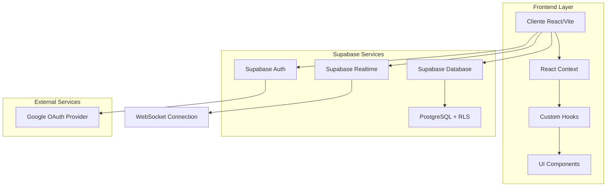
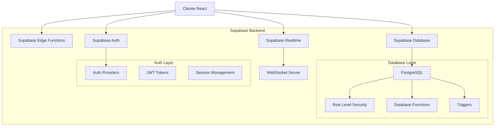
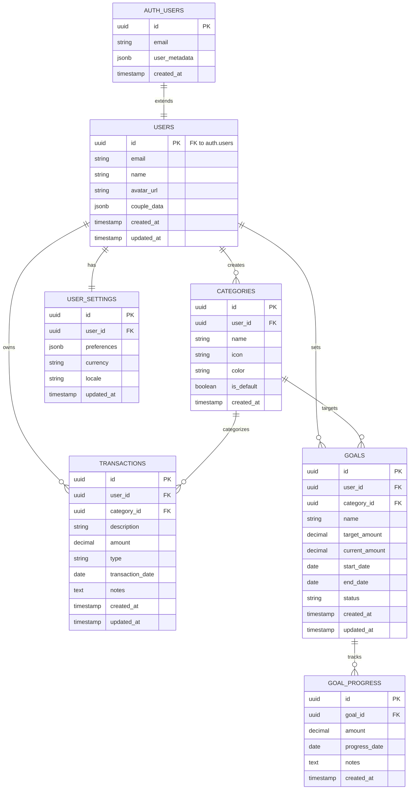

# Arquitetura Técnica - Integração ZetaFin com Supabase

## 1. Arquitetura Geral



## 2. Stack Tecnológico

### Frontend
- **React 18** + **TypeScript** + **Vite** (build tool)
- **TailwindCSS 3** (estilização)
- **@supabase/supabase-js** (cliente Supabase)
- **@supabase/auth-ui-react** (componentes de autenticação)
- **Chart.js** + **react-chartjs-2** (gráficos)
- **Lucide React** (ícones)

### Backend/Serviços
- **Supabase** (Backend-as-a-Service)
  - PostgreSQL (banco de dados)
  - Auth (autenticação)
  - Realtime (sincronização)
  - Storage (arquivos, se necessário)

### Autenticação
- **Google OAuth 2.0** via Supabase Auth
- **Row Level Security (RLS)** no PostgreSQL

## 3. Definição de Rotas

| Rota | Propósito | Proteção |
|------|-----------|----------|
| `/` | Página inicial/redirecionamento | Pública |
| `/login` | Tela de autenticação Google OAuth | Pública |
| `/dashboard` | Dashboard principal com visão geral | Protegida |
| `/transacoes` | Gestão de transações financeiras | Protegida |
| `/relatorios/periodo` | Relatórios por período | Protegida |
| `/relatorios/categorias` | Análise por categorias | Protegida |
| `/relatorios/frequentes` | Gastos frequentes | Protegida |
| `/relatorios/tendencias` | Tendências e projeções | Protegida |
| `/relatorios/metas` | Acompanhamento de metas | Protegida |
| `/perfil` | Configurações do perfil | Protegida |
| `/configuracoes` | Configurações do sistema | Protegida |

## 4. APIs e Integrações

### 4.1 Autenticação

**Login com Google**
```typescript
// Endpoint: Supabase Auth
// Método: OAuth redirect
supabase.auth.signInWithOAuth({
  provider: 'google',
  options: {
    redirectTo: `${window.location.origin}/dashboard`
  }
})
```

**Logout**
```typescript
// Endpoint: Supabase Auth
// Método: POST
supabase.auth.signOut()
```

### 4.2 Gestão de Usuários

**Criar/Atualizar Perfil**
```typescript
// Tabela: users
// Método: INSERT/UPDATE
interface UserProfile {
  id: string;          // UUID do auth.users
  email: string;       // Email do Google
  name: string;        // Nome completo
  avatar_url?: string; // URL do avatar do Google
  couple_data: object; // Dados do casal
}
```

### 4.3 Transações Financeiras

**Listar Transações**
```typescript
// Tabela: transactions
// Método: SELECT com JOIN
const { data } = await supabase
  .from('transactions')
  .select(`
    *,
    category:categories(name, icon, color)
  `)
  .order('transaction_date', { ascending: false })
```

**Criar Transação**
```typescript
// Tabela: transactions
// Método: INSERT
interface Transaction {
  description: string;
  amount: number;
  type: 'RECEITA' | 'DESPESA';
  transaction_date: string;
  category_id: string;
  notes?: string;
}
```

### 4.4 Categorias

**Listar Categorias do Usuário**
```typescript
// Tabela: categories
// Método: SELECT
const { data } = await supabase
  .from('categories')
  .select('*')
  .order('name')
```

**Criar Categoria**
```typescript
// Tabela: categories
// Método: INSERT
interface Category {
  name: string;
  icon: string;
  color: string;
}
```

### 4.5 Metas Financeiras

**Listar Metas**
```typescript
// Tabela: goals
// Método: SELECT com JOIN
const { data } = await supabase
  .from('goals')
  .select(`
    *,
    category:categories(name, icon, color)
  `)
  .eq('status', 'ATIVA')
```

**Criar Meta**
```typescript
// Tabela: goals
// Método: INSERT
interface Goal {
  name: string;
  target_amount: number;
  category_id?: string;
  start_date: string;
  end_date: string;
}
```

## 5. Arquitetura do Servidor (Supabase)



## 6. Modelo de Dados

### 6.1 Diagrama Entidade-Relacionamento



### 6.2 Scripts de Criação (DDL)

**Tabela de Usuários**
```sql
-- Estende auth.users do Supabase
CREATE TABLE public.users (
    id UUID REFERENCES auth.users(id) ON DELETE CASCADE PRIMARY KEY,
    email VARCHAR(255) NOT NULL,
    name VARCHAR(255) NOT NULL,
    avatar_url TEXT,
    couple_data JSONB DEFAULT '{}',
    created_at TIMESTAMP WITH TIME ZONE DEFAULT NOW(),
    updated_at TIMESTAMP WITH TIME ZONE DEFAULT NOW()
);

-- RLS Policy
ALTER TABLE public.users ENABLE ROW LEVEL SECURITY;
CREATE POLICY "Users can view own profile" ON public.users
    FOR SELECT USING (auth.uid() = id);
CREATE POLICY "Users can update own profile" ON public.users
    FOR UPDATE USING (auth.uid() = id);
```

**Tabela de Categorias**
```sql
CREATE TABLE public.categories (
    id UUID DEFAULT gen_random_uuid() PRIMARY KEY,
    user_id UUID REFERENCES public.users(id) ON DELETE CASCADE,
    name VARCHAR(100) NOT NULL,
    icon VARCHAR(50) DEFAULT 'DollarSign',
    color VARCHAR(7) DEFAULT '#3B82F6',
    is_default BOOLEAN DEFAULT FALSE,
    created_at TIMESTAMP WITH TIME ZONE DEFAULT NOW(),
    
    UNIQUE(user_id, name)
);

-- Índices
CREATE INDEX idx_categories_user_id ON public.categories(user_id);

-- RLS Policies
ALTER TABLE public.categories ENABLE ROW LEVEL SECURITY;
CREATE POLICY "Users can manage own categories" ON public.categories
    USING (auth.uid() = user_id);
```

**Tabela de Transações**
```sql
CREATE TABLE public.transactions (
    id UUID DEFAULT gen_random_uuid() PRIMARY KEY,
    user_id UUID REFERENCES public.users(id) ON DELETE CASCADE,
    category_id UUID REFERENCES public.categories(id) ON DELETE SET NULL,
    description VARCHAR(255) NOT NULL,
    amount DECIMAL(12,2) NOT NULL,
    type VARCHAR(20) CHECK (type IN ('RECEITA', 'DESPESA')) NOT NULL,
    transaction_date DATE NOT NULL,
    notes TEXT,
    created_at TIMESTAMP WITH TIME ZONE DEFAULT NOW(),
    updated_at TIMESTAMP WITH TIME ZONE DEFAULT NOW()
);

-- Índices para performance
CREATE INDEX idx_transactions_user_id ON public.transactions(user_id);
CREATE INDEX idx_transactions_date ON public.transactions(transaction_date DESC);
CREATE INDEX idx_transactions_category ON public.transactions(category_id);
CREATE INDEX idx_transactions_type ON public.transactions(type);

-- RLS Policies
ALTER TABLE public.transactions ENABLE ROW LEVEL SECURITY;
CREATE POLICY "Users can manage own transactions" ON public.transactions
    USING (auth.uid() = user_id);
```

**Tabela de Metas**
```sql
CREATE TABLE public.goals (
    id UUID DEFAULT gen_random_uuid() PRIMARY KEY,
    user_id UUID REFERENCES public.users(id) ON DELETE CASCADE,
    category_id UUID REFERENCES public.categories(id) ON DELETE SET NULL,
    name VARCHAR(255) NOT NULL,
    target_amount DECIMAL(12,2) NOT NULL,
    current_amount DECIMAL(12,2) DEFAULT 0,
    start_date DATE NOT NULL,
    end_date DATE NOT NULL,
    status VARCHAR(20) DEFAULT 'ATIVA' CHECK (status IN ('ATIVA', 'CONCLUIDA', 'PAUSADA')),
    created_at TIMESTAMP WITH TIME ZONE DEFAULT NOW(),
    updated_at TIMESTAMP WITH TIME ZONE DEFAULT NOW(),
    
    CONSTRAINT valid_date_range CHECK (end_date > start_date),
    CONSTRAINT positive_target CHECK (target_amount > 0)
);

-- Índices
CREATE INDEX idx_goals_user_id ON public.goals(user_id);
CREATE INDEX idx_goals_status ON public.goals(status);
CREATE INDEX idx_goals_dates ON public.goals(start_date, end_date);

-- RLS Policies
ALTER TABLE public.goals ENABLE ROW LEVEL SECURITY;
CREATE POLICY "Users can manage own goals" ON public.goals
    USING (auth.uid() = user_id);
```

**Funções e Triggers**
```sql
-- Função para atualizar updated_at automaticamente
CREATE OR REPLACE FUNCTION update_updated_at_column()
RETURNS TRIGGER AS $$
BEGIN
    NEW.updated_at = NOW();
    RETURN NEW;
END;
$$ language 'plpgsql';

-- Triggers para updated_at
CREATE TRIGGER update_users_updated_at 
    BEFORE UPDATE ON public.users
    FOR EACH ROW EXECUTE FUNCTION update_updated_at_column();

CREATE TRIGGER update_transactions_updated_at 
    BEFORE UPDATE ON public.transactions
    FOR EACH ROW EXECUTE FUNCTION update_updated_at_column();

CREATE TRIGGER update_goals_updated_at 
    BEFORE UPDATE ON public.goals
    FOR EACH ROW EXECUTE FUNCTION update_updated_at_column();

-- Função para criar categorias padrão
CREATE OR REPLACE FUNCTION create_default_categories(user_uuid UUID)
RETURNS VOID AS $$
BEGIN
    INSERT INTO public.categories (user_id, name, icon, color, is_default) VALUES
    (user_uuid, 'Alimentação', 'Utensils', '#EF4444', true),
    (user_uuid, 'Transporte', 'Car', '#3B82F6', true),
    (user_uuid, 'Moradia', 'Home', '#10B981', true),
    (user_uuid, 'Saúde', 'Heart', '#F59E0B', true),
    (user_uuid, 'Lazer', 'Gamepad2', '#8B5CF6', true),
    (user_uuid, 'Salário', 'DollarSign', '#059669', true),
    (user_uuid, 'Trabalho Extra', 'Briefcase', '#0EA5E9', true);
END;
$$ LANGUAGE plpgsql SECURITY DEFINER;

-- Trigger para criar categorias padrão para novos usuários
CREATE OR REPLACE FUNCTION handle_new_user()
RETURNS TRIGGER AS $$
BEGIN
    -- Criar categorias padrão
    PERFORM create_default_categories(NEW.id);
    
    -- Criar configurações padrão
    INSERT INTO public.user_settings (user_id, currency, locale)
    VALUES (NEW.id, 'BRL', 'pt-BR');
    
    RETURN NEW;
END;
$$ LANGUAGE plpgsql SECURITY DEFINER;

CREATE TRIGGER on_auth_user_created
    AFTER INSERT ON public.users
    FOR EACH ROW EXECUTE FUNCTION handle_new_user();
```

## 7. Segurança e Autenticação

### 7.1 Configuração do Google OAuth

```typescript
// Configuração no Supabase Dashboard
const googleOAuthConfig = {
  clientId: process.env.GOOGLE_CLIENT_ID,
  clientSecret: process.env.GOOGLE_CLIENT_SECRET,
  redirectUrl: `${process.env.SUPABASE_URL}/auth/v1/callback`
}
```

### 7.2 Row Level Security (RLS)

```sql
-- Política base: usuários só acessam seus próprios dados
CREATE POLICY "Users can only access own data" ON public.transactions
    FOR ALL USING (auth.uid() = user_id);

-- Política para leitura de categorias padrão
CREATE POLICY "Users can view default categories" ON public.categories
    FOR SELECT USING (is_default = true OR auth.uid() = user_id);
```

### 7.3 Validação de Dados

```typescript
// Validação no frontend antes de enviar para Supabase
const validateTransaction = (transaction: Transaction) => {
  if (!transaction.description?.trim()) {
    throw new Error('Descrição é obrigatória')
  }
  if (transaction.amount <= 0) {
    throw new Error('Valor deve ser maior que zero')
  }
  if (!['RECEITA', 'DESPESA'].includes(transaction.type)) {
    throw new Error('Tipo inválido')
  }
}
```

## 8. Performance e Otimização

### 8.1 Estratégias de Cache

```typescript
// Cache de categorias (raramente mudam)
const useCategories = () => {
  const [categories, setCategories] = useState<Category[]>([])
  const [lastFetch, setLastFetch] = useState<number>(0)
  
  const fetchCategories = async () => {
    // Cache por 5 minutos
    if (Date.now() - lastFetch < 5 * 60 * 1000) {
      return categories
    }
    
    const { data } = await supabase.from('categories').select('*')
    setCategories(data || [])
    setLastFetch(Date.now())
    return data
  }
}
```

### 8.2 Paginação e Lazy Loading

```typescript
// Paginação para transações
const useTransactionsPaginated = (pageSize = 20) => {
  const [transactions, setTransactions] = useState<Transaction[]>([])
  const [loading, setLoading] = useState(false)
  const [hasMore, setHasMore] = useState(true)
  
  const loadMore = async () => {
    if (loading || !hasMore) return
    
    setLoading(true)
    const { data } = await supabase
      .from('transactions')
      .select('*')
      .range(transactions.length, transactions.length + pageSize - 1)
      .order('transaction_date', { ascending: false })
    
    if (data && data.length > 0) {
      setTransactions(prev => [...prev, ...data])
      setHasMore(data.length === pageSize)
    } else {
      setHasMore(false)
    }
    setLoading(false)
  }
}
```

### 8.3 Realtime Subscriptions

```typescript
// Subscription para atualizações em tempo real
const useRealtimeTransactions = () => {
  const { user } = useAuth()
  const [transactions, setTransactions] = useState<Transaction[]>([])
  
  useEffect(() => {
    if (!user) return
    
    const subscription = supabase
      .channel('transactions')
      .on('postgres_changes', {
        event: '*',
        schema: 'public',
        table: 'transactions',
        filter: `user_id=eq.${user.id}`
      }, (payload) => {
        if (payload.eventType === 'INSERT') {
          setTransactions(prev => [payload.new as Transaction, ...prev])
        } else if (payload.eventType === 'UPDATE') {
          setTransactions(prev => 
            prev.map(t => t.id === payload.new.id ? payload.new as Transaction : t)
          )
        } else if (payload.eventType === 'DELETE') {
          setTransactions(prev => prev.filter(t => t.id !== payload.old.id))
        }
      })
      .subscribe()
    
    return () => {
      subscription.unsubscribe()
    }
  }, [user])
}
```

## 9. Monitoramento e Logs

### 9.1 Métricas de Performance

```typescript
// Monitoramento de tempo de resposta
const trackApiCall = async (operation: string, apiCall: () => Promise<any>) => {
  const startTime = performance.now()
  try {
    const result = await apiCall()
    const duration = performance.now() - startTime
    
    // Enviar métrica para analytics
    analytics.track('api_call', {
      operation,
      duration,
      success: true
    })
    
    return result
  } catch (error) {
    const duration = performance.now() - startTime
    
    analytics.track('api_call', {
      operation,
      duration,
      success: false,
      error: error.message
    })
    
    throw error
  }
}
```

### 9.2 Error Handling

```typescript
// Handler global de erros
const handleSupabaseError = (error: any) => {
  console.error('Supabase Error:', error)
  
  if (error.code === 'PGRST116') {
    return 'Dados não encontrados'
  } else if (error.code === '23505') {
    return 'Este item já existe'
  } else if (error.message?.includes('JWT')) {
    return 'Sessão expirada. Faça login novamente.'
  }
  
  return 'Erro interno. Tente novamente.'
}
```

## 10. Deploy e Configuração

### 10.1 Variáveis de Ambiente

```env
# .env.local
VITE_SUPABASE_URL=https://seuprojetoid.supabase.co
VITE_SUPABASE_ANON_KEY=sua_chave_anonima_publica
VITE_GOOGLE_CLIENT_ID=seu_google_client_id
```

### 10.2 Build e Deploy

```json
{
  "scripts": {
    "build": "tsc && vite build",
    "preview": "vite preview",
    "deploy": "npm run build && vercel --prod"
  }
}
```

Esta arquitetura técnica fornece uma base sólida para a migração do ZetaFin para Supabase, garantindo escalabilidade, segurança e performance adequadas para uma aplicação de gestão financeira moderna.