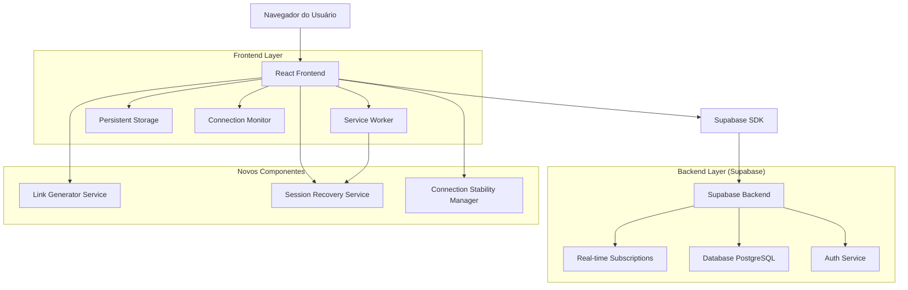
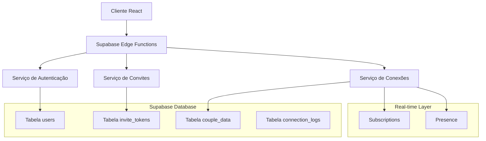
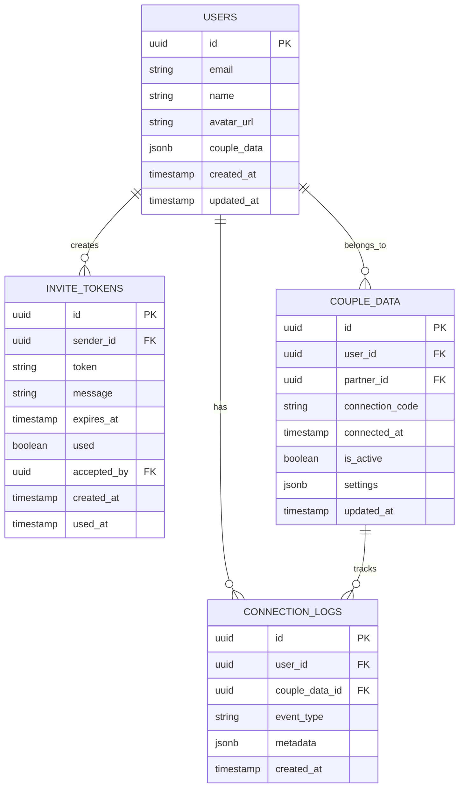

# Arquitetura Técnica - Melhorias no Sistema de Conexão de Parceiros

## 1. Diagrama de Arquitetura



## 2. Descrição das Tecnologias

* Frontend: React\@18 + TypeScript + Tailwind CSS + Vite

* Backend: Supabase (PostgreSQL + Real-time + Auth)

* Persistência: localStorage + sessionStorage + IndexedDB

* Monitoramento: Service Worker + Network API

* Notificações: Sonner Toast + Push Notifications

## 3. Definições de Rotas

| Rota                  | Propósito                                                 |
| --------------------- | --------------------------------------------------------- |
| /couple-data          | Página principal de gerenciamento de conexão de parceiros |
| /invite/:token        | Nova página para aceitar convites via link compartilhável |
| /couple-data/settings | Configurações avançadas de compartilhamento e privacidade |
| /couple-data/history  | Histórico de conexões e atividades do casal               |

## 4. Definições de API

### 4.1 APIs Principais

**Geração de Links de Convite**

```
POST /api/couple/generate-invite-link
```

Request:

| Nome do Parâmetro | Tipo   | Obrigatório | Descrição                             |
| ----------------- | ------ | ----------- | ------------------------------------- |
| expiration\_hours | number | false       | Horas até expiração (padrão: 24h)     |
| message           | string | false       | Mensagem personalizada para o convite |

Response:

| Nome do Parâmetro | Tipo   | Descrição                       |
| ----------------- | ------ | ------------------------------- |
| invite\_link      | string | URL completa do link de convite |
| token             | string | Token único do convite          |
| expires\_at       | string | Data/hora de expiração          |

Exemplo:

```json
{
  "invite_link": "https://zetafin.app/invite/abc123def456",
  "token": "abc123def456",
  "expires_at": "2024-12-14T10:30:00Z"
}
```

**Validação de Token de Convite**

```
GET /api/couple/validate-invite/:token
```

Response:

| Nome do Parâmetro | Tipo    | Descrição                            |
| ----------------- | ------- | ------------------------------------ |
| valid             | boolean | Se o token é válido                  |
| sender\_name      | string  | Nome do usuário que enviou o convite |
| sender\_email     | string  | Email do remetente                   |
| expires\_at       | string  | Data de expiração                    |

**Aceitar Convite**

```
POST /api/couple/accept-invite
```

Request:

| Nome do Parâmetro | Tipo    | Obrigatório | Descrição                  |
| ----------------- | ------- | ----------- | -------------------------- |
| token             | string  | true        | Token do convite           |
| accept            | boolean | true        | Aceitar ou recusar convite |

**Monitoramento de Conexão**

```
GET /api/couple/connection-status
```

Response:

| Nome do Parâmetro | Tipo    | Descrição                 |
| ----------------- | ------- | ------------------------- |
| connected         | boolean | Status da conexão         |
| last\_sync        | string  | Última sincronização      |
| partner\_online   | boolean | Se o parceiro está online |

## 5. Arquitetura do Servidor



## 6. Modelo de Dados

### 6.1 Definição do Modelo de Dados



### 6.2 Linguagem de Definição de Dados

**Tabela de Tokens de Convite (invite\_tokens)**

```sql
-- Criar tabela
CREATE TABLE invite_tokens (
    id UUID PRIMARY KEY DEFAULT gen_random_uuid(),
    sender_id UUID NOT NULL REFERENCES users(id) ON DELETE CASCADE,
    token VARCHAR(255) UNIQUE NOT NULL,
    message TEXT,
    expires_at TIMESTAMP WITH TIME ZONE NOT NULL,
    used BOOLEAN DEFAULT FALSE,
    accepted_by UUID REFERENCES users(id) ON DELETE SET NULL,
    created_at TIMESTAMP WITH TIME ZONE DEFAULT NOW(),
    used_at TIMESTAMP WITH TIME ZONE
);

-- Criar índices
CREATE INDEX idx_invite_tokens_token ON invite_tokens(token);
CREATE INDEX idx_invite_tokens_sender_id ON invite_tokens(sender_id);
CREATE INDEX idx_invite_tokens_expires_at ON invite_tokens(expires_at);

-- Políticas RLS
ALTER TABLE invite_tokens ENABLE ROW LEVEL SECURITY;

CREATE POLICY "invite_tokens_select_policy" ON invite_tokens
  FOR SELECT USING (
    auth.uid() = sender_id OR 
    auth.uid() = accepted_by OR
    (used = FALSE AND expires_at > NOW())
  );

CREATE POLICY "invite_tokens_insert_policy" ON invite_tokens
  FOR INSERT WITH CHECK (auth.uid() = sender_id);

CREATE POLICY "invite_tokens_update_policy" ON invite_tokens
  FOR UPDATE USING (auth.uid() = sender_id OR token IN (
    SELECT token FROM invite_tokens WHERE used = FALSE AND expires_at > NOW()
  ));
```

**Tabela de Logs de Conexão (connection\_logs)**

```sql
-- Criar tabela
CREATE TABLE connection_logs (
    id UUID PRIMARY KEY DEFAULT gen_random_uuid(),
    user_id UUID NOT NULL REFERENCES users(id) ON DELETE CASCADE,
    couple_data_id UUID REFERENCES couple_data(id) ON DELETE SET NULL,
    event_type VARCHAR(50) NOT NULL CHECK (event_type IN (
        'connection_established',
        'connection_lost',
        'reconnection_attempt',
        'session_recovered',
        'tab_change_detected',
        'network_status_change'
    )),
    metadata JSONB DEFAULT '{}',
    created_at TIMESTAMP WITH TIME ZONE DEFAULT NOW()
);

-- Criar índices
CREATE INDEX idx_connection_logs_user_id ON connection_logs(user_id);
CREATE INDEX idx_connection_logs_event_type ON connection_logs(event_type);
CREATE INDEX idx_connection_logs_created_at ON connection_logs(created_at DESC);

-- Políticas RLS
ALTER TABLE connection_logs ENABLE ROW LEVEL SECURITY;

CREATE POLICY "connection_logs_select_policy" ON connection_logs
  FOR SELECT USING (auth.uid() = user_id);

CREATE POLICY "connection_logs_insert_policy" ON connection_logs
  FOR INSERT WITH CHECK (auth.uid() = user_id);
```

**Função para Limpeza Automática de Tokens Expirados**

```sql
-- Função para limpar tokens expirados
CREATE OR REPLACE FUNCTION cleanup_expired_invite_tokens()
RETURNS void AS $$
BEGIN
    DELETE FROM invite_tokens 
    WHERE expires_at < NOW() AND used = FALSE;
    
    RAISE NOTICE 'Tokens expirados removidos com sucesso';
END;
$$ LANGUAGE plpgsql SECURITY DEFINER;

-- Agendar limpeza automática (executar diariamente)
SELECT cron.schedule('cleanup-expired-tokens', '0 2 * * *', 'SELECT cleanup_expired_invite_tokens();');
```

**Função para Gerar Token Único**

```sql
-- Função para gerar token único de convite
CREATE OR REPLACE FUNCTION generate_unique_invite_token()
RETURNS TEXT AS $$
DECLARE
    token TEXT;
    exists_token BOOLEAN;
BEGIN
    LOOP
        -- Gerar token aleatório de 32 caracteres
        token := encode(gen_random_bytes(24), 'base64');
        token := replace(replace(replace(token, '/', ''), '+', ''), '=', '');
        token := substr(token, 1, 32);
        
        -- Verificar se já existe
        SELECT EXISTS(SELECT 1 FROM invite_tokens WHERE token = token) INTO exists_token;
        
        -- Se não existe, retornar
        IF NOT exists_token THEN
            RETURN token;
        END IF;
    END LOOP;
END;
$$ LANGUAGE plpgsql SECURITY DEFINER;
```

**Dados Iniciais**

```sql
-- Inserir configurações padrão para novos usuários
INSERT INTO user_settings (user_id, setting_key, setting_value)
SELECT 
    id,
    'connection_stability',
    '{"auto_reconnect": true, "session_timeout": 3600, "heartbeat_interval": 30}'
FROM users 
WHERE id NOT IN (SELECT user_id FROM user_settings WHERE setting_key = 'connection_stability');
```

