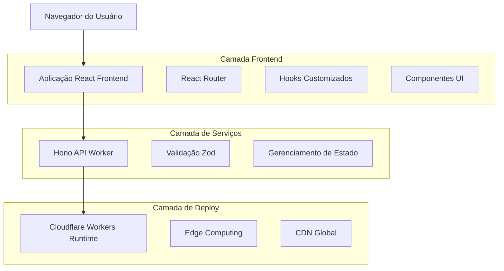
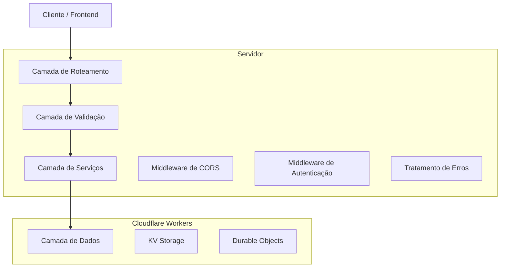
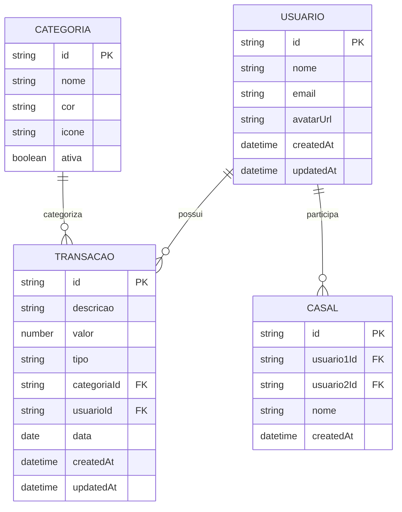

# Documento de Arquitetura Técnica - ZetaFin

## 1. Design da Arquitetura



## 2. Descrição das Tecnologias

* **Frontend**: React\@19 + TypeScript + Vite + Tailwind CSS

* **Backend**: Hono\@4.7.7 (Framework web para Cloudflare Workers)

* **Deploy**: Cloudflare Workers (Serverless Edge Computing)

* **Gráficos**: Recharts\@3.2.1

* **Validação**: Zod\@3.24.3

* **Roteamento**: React Router\@7.5.3

* **Ícones**: Lucide React\@0.510.0

## 3. Definições de Rotas

| Rota                  | Propósito                                                              |
| --------------------- | ---------------------------------------------------------------------- |
| /                     | Página inicial - Dashboard com visão geral financeira                  |
| /transacoes           | Página de transações - Lista e gerenciamento de movimentações          |
| /nova-transacao       | Página de nova transação - Formulário para adicionar receitas/despesas |
| /editar-transacao/:id | Página de edição - Modificar transação específica                      |
| /relatorios           | Página de relatórios - Análises e gráficos financeiros                 |
| /perfil               | Página de perfil - Configurações e dados do usuário                    |
| /perfil/configuracoes | Subpágina de configurações - Preferências do aplicativo                |
| /perfil/notificacoes  | Subpágina de notificações - Alertas e lembretes                        |
| /perfil/dados-casal   | Subpágina de dados do casal - Informações compartilhadas               |
| /perfil/ajuda         | Subpágina de ajuda - Suporte e FAQ                                     |

## 4. Definições de API

### 4.1 API Principal

**Transações**

```
GET /api/transacoes
```

Request:

| Nome do Parâmetro | Tipo   | Obrigatório | Descrição                         |
| ----------------- | ------ | ----------- | --------------------------------- |
| page              | number | false       | Número da página para paginação   |
| limit             | number | false       | Limite de itens por página        |
| categoria         | string | false       | Filtro por categoria              |
| tipo              | string | false       | Filtro por tipo (receita/despesa) |

Response:

| Nome do Parâmetro | Tipo   | Descrição           |
| ----------------- | ------ | ------------------- |
| transacoes        | array  | Lista de transações |
| total             | number | Total de transações |
| page              | number | Página atual        |

Exemplo:

```json
{
  "transacoes": [
    {
      "id": "1",
      "descricao": "Salário",
      "valor": 5000,
      "tipo": "receita",
      "categoria": "Trabalho",
      "data": "2024-01-15"
    }
  ],
  "total": 150,
  "page": 1
}
```

**Criar Transação**

```
POST /api/transacoes
```

Request:

| Nome do Parâmetro | Tipo   | Obrigatório | Descrição                    |
| ----------------- | ------ | ----------- | ---------------------------- |
| descricao         | string | true        | Descrição da transação       |
| valor             | number | true        | Valor da transação           |
| tipo              | string | true        | Tipo: 'receita' ou 'despesa' |
| categoriaId       | string | true        | ID da categoria              |
| data              | string | true        | Data da transação (ISO)      |

Response:

| Nome do Parâmetro | Tipo    | Descrição                 |
| ----------------- | ------- | ------------------------- |
| success           | boolean | Status da operação        |
| transacao         | object  | Dados da transação criada |

## 5. Diagrama da Arquitetura do Servidor



## 6. Modelo de Dados

### 6.1 Definição do Modelo de Dados



### 6.2 Linguagem de Definição de Dados

**Tabela de Usuários (users)**

```sql
-- Criar tabela
CREATE TABLE users (
    id UUID PRIMARY KEY DEFAULT gen_random_uuid(),
    nome VARCHAR(100) NOT NULL,
    email VARCHAR(255) UNIQUE NOT NULL,
    avatar_url VARCHAR(500),
    created_at TIMESTAMP WITH TIME ZONE DEFAULT NOW(),
    updated_at TIMESTAMP WITH TIME ZONE DEFAULT NOW()
);

-- Criar índices
CREATE INDEX idx_users_email ON users(email);
CREATE INDEX idx_users_created_at ON users(created_at DESC);

-- Dados iniciais
INSERT INTO users (nome, email) VALUES 
('Usuário Demo', 'demo@zetafin.com');
```

**Tabela de Categorias (categories)**

```sql
-- Criar tabela
CREATE TABLE categories (
    id UUID PRIMARY KEY DEFAULT gen_random_uuid(),
    nome VARCHAR(50) NOT NULL,
    cor VARCHAR(7) DEFAULT '#6B7280',
    icone VARCHAR(50) DEFAULT 'folder',
    ativa BOOLEAN DEFAULT true,
    created_at TIMESTAMP WITH TIME ZONE DEFAULT NOW()
);

-- Dados iniciais
INSERT INTO categories (nome, cor, icone) VALUES 
('Alimentação', '#EF4444', 'utensils'),
('Transporte', '#3B82F6', 'car'),
('Moradia', '#10B981', 'home'),
('Saúde', '#F59E0B', 'heart'),
('Educação', '#8B5CF6', 'book'),
('Lazer', '#EC4899', 'gamepad'),
('Trabalho', '#6B7280', 'briefcase'),
('Outros', '#9CA3AF', 'more-horizontal');
```

**Tabela de Transações (transactions)**

```sql
-- Criar tabela
CREATE TABLE transactions (
    id UUID PRIMARY KEY DEFAULT gen_random_uuid(),
    descricao VARCHAR(200) NOT NULL,
    valor DECIMAL(10,2) NOT NULL,
    tipo VARCHAR(10) CHECK (tipo IN ('receita', 'despesa')) NOT NULL,
    categoria_id UUID REFERENCES categories(id),
    usuario_id UUID REFERENCES users(id),
    data DATE NOT NULL,
    created_at TIMESTAMP WITH TIME ZONE DEFAULT NOW(),
    updated_at TIMESTAMP WITH TIME ZONE DEFAULT NOW()
);

-- Criar índices
CREATE INDEX idx_transactions_usuario_id ON transactions(usuario_id);
CREATE INDEX idx_transactions_categoria_id ON transactions(categoria_id);
CREATE INDEX idx_transactions_data ON transactions(data DESC);
CREATE INDEX idx_transactions_tipo ON transactions(tipo);

-- Dados iniciais de exemplo
INSERT INTO transactions (descricao, valor, tipo, categoria_id, usuario_id, data) VALUES 
('Salário Mensal', 5000.00, 'receita', (SELECT id FROM categories WHERE nome = 'Trabalho'), (SELECT id FROM users WHERE email = 'demo@zetafin.com'), '2024-01-01'),
('Supermercado', 350.00, 'despesa', (SELECT id FROM categories WHERE nome = 'Alimentação'), (SELECT id FROM users WHERE email = 'demo@zetafin.com'), '2024-01-02'),
('Combustível', 200.00, 'despesa', (SELECT id FROM categories WHERE nome = 'Transporte'), (SELECT id FROM users WHERE email = 'demo@zetafin.com'), '2024-01-03');
```

**Tabela de Casais (couples)**

```sql
-- Criar tabela
CREATE TABLE couples (
    id UUID PRIMARY KEY DEFAULT gen_random_uuid(),
    usuario1_id UUID REFERENCES users(id),
    usuario2_id UUID REFERENCES users(id),
    nome VARCHAR(100),
    created_at TIMESTAMP WITH TIME ZONE DEFAULT NOW(),
    UNIQUE(usuario1_id, usuario2_id)
);

-- Criar índices
CREATE INDEX idx_couples_usuario1 ON couples(usuario1_id);
CREATE INDEX idx_couples_usuario2 ON couples(usuario2_id);
```

