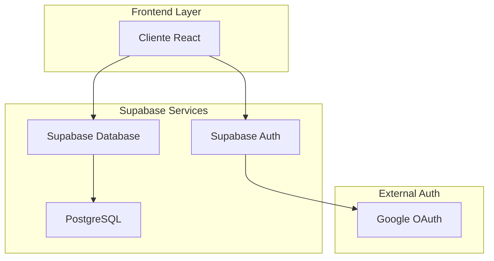
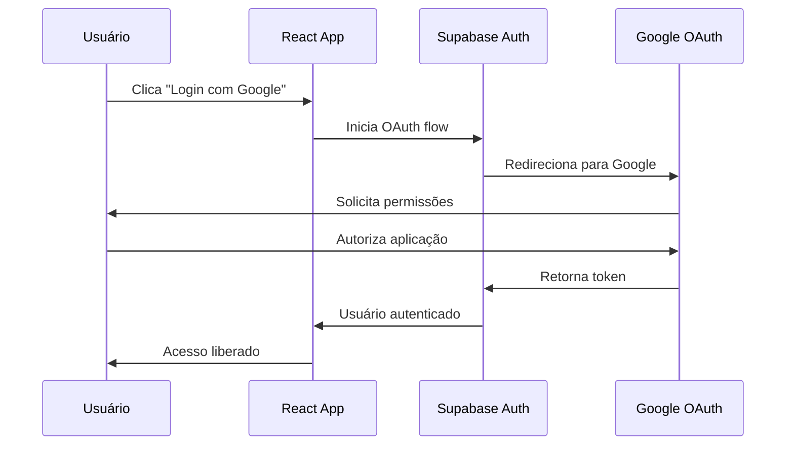
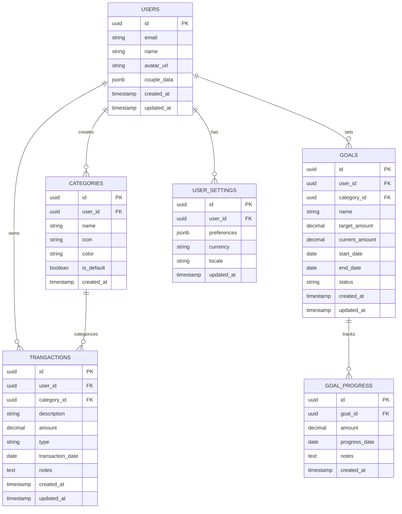

# Integração Completa ZetaFin com Supabase e Autenticação Google

## 1. Visão Geral da Integração

### 1.1 Objetivos
- Migrar completamente do localStorage para banco de dados Supabase
- Implementar autenticação segura via Google OAuth
- Manter compatibilidade com estrutura atual do React
- Remover todos os dados fictícios hardcoded
- Implementar sincronização em tempo real

### 1.2 Benefícios da Migração
- **Persistência de dados**: Dados seguros na nuvem
- **Sincronização**: Acesso em múltiplos dispositivos
- **Autenticação robusta**: Login via Google OAuth
- **Escalabilidade**: Suporte a múltiplos usuários
- **Backup automático**: Dados protegidos contra perda

## 2. Arquitetura da Solução

### 2.1 Diagrama de Arquitetura



### 2.2 Fluxo de Autenticação



## 3. Estrutura do Banco de Dados

### 3.1 Modelo de Dados



### 3.2 Scripts de Criação das Tabelas

```sql
-- Habilitar extensões necessárias
CREATE EXTENSION IF NOT EXISTS "uuid-ossp";

-- Tabela de usuários (integrada com auth.users)
CREATE TABLE public.users (
    id UUID REFERENCES auth.users(id) PRIMARY KEY,
    email VARCHAR(255) NOT NULL,
    name VARCHAR(255) NOT NULL,
    avatar_url TEXT,
    couple_data JSONB DEFAULT '{}',
    created_at TIMESTAMP WITH TIME ZONE DEFAULT NOW(),
    updated_at TIMESTAMP WITH TIME ZONE DEFAULT NOW()
);

-- Tabela de categorias
CREATE TABLE public.categories (
    id UUID DEFAULT uuid_generate_v4() PRIMARY KEY,
    user_id UUID REFERENCES public.users(id) ON DELETE CASCADE,
    name VARCHAR(100) NOT NULL,
    icon VARCHAR(50) DEFAULT 'DollarSign',
    color VARCHAR(7) DEFAULT '#3B82F6',
    is_default BOOLEAN DEFAULT FALSE,
    created_at TIMESTAMP WITH TIME ZONE DEFAULT NOW()
);

-- Tabela de transações
CREATE TABLE public.transactions (
    id UUID DEFAULT uuid_generate_v4() PRIMARY KEY,
    user_id UUID REFERENCES public.users(id) ON DELETE CASCADE,
    category_id UUID REFERENCES public.categories(id) ON DELETE SET NULL,
    description VARCHAR(255) NOT NULL,
    amount DECIMAL(12,2) NOT NULL,
    type VARCHAR(20) CHECK (type IN ('RECEITA', 'DESPESA')) NOT NULL,
    transaction_date DATE NOT NULL,
    notes TEXT,
    created_at TIMESTAMP WITH TIME ZONE DEFAULT NOW(),
    updated_at TIMESTAMP WITH TIME ZONE DEFAULT NOW()
);

-- Tabela de metas
CREATE TABLE public.goals (
    id UUID DEFAULT uuid_generate_v4() PRIMARY KEY,
    user_id UUID REFERENCES public.users(id) ON DELETE CASCADE,
    category_id UUID REFERENCES public.categories(id) ON DELETE SET NULL,
    name VARCHAR(255) NOT NULL,
    target_amount DECIMAL(12,2) NOT NULL,
    current_amount DECIMAL(12,2) DEFAULT 0,
    start_date DATE NOT NULL,
    end_date DATE NOT NULL,
    status VARCHAR(20) DEFAULT 'ATIVA' CHECK (status IN ('ATIVA', 'CONCLUIDA', 'PAUSADA')),
    created_at TIMESTAMP WITH TIME ZONE DEFAULT NOW(),
    updated_at TIMESTAMP WITH TIME ZONE DEFAULT NOW()
);

-- Tabela de progresso das metas
CREATE TABLE public.goal_progress (
    id UUID DEFAULT uuid_generate_v4() PRIMARY KEY,
    goal_id UUID REFERENCES public.goals(id) ON DELETE CASCADE,
    amount DECIMAL(12,2) NOT NULL,
    progress_date DATE NOT NULL,
    notes TEXT,
    created_at TIMESTAMP WITH TIME ZONE DEFAULT NOW()
);

-- Tabela de configurações do usuário
CREATE TABLE public.user_settings (
    id UUID DEFAULT uuid_generate_v4() PRIMARY KEY,
    user_id UUID REFERENCES public.users(id) ON DELETE CASCADE,
    preferences JSONB DEFAULT '{}',
    currency VARCHAR(3) DEFAULT 'BRL',
    locale VARCHAR(5) DEFAULT 'pt-BR',
    updated_at TIMESTAMP WITH TIME ZONE DEFAULT NOW()
);

-- Índices para performance
CREATE INDEX idx_transactions_user_id ON public.transactions(user_id);
CREATE INDEX idx_transactions_date ON public.transactions(transaction_date DESC);
CREATE INDEX idx_transactions_category ON public.transactions(category_id);
CREATE INDEX idx_categories_user_id ON public.categories(user_id);
CREATE INDEX idx_goals_user_id ON public.goals(user_id);
CREATE INDEX idx_goal_progress_goal_id ON public.goal_progress(goal_id);

-- Triggers para updated_at
CREATE OR REPLACE FUNCTION update_updated_at_column()
RETURNS TRIGGER AS $$
BEGIN
    NEW.updated_at = NOW();
    RETURN NEW;
END;
$$ language 'plpgsql';

CREATE TRIGGER update_users_updated_at BEFORE UPDATE ON public.users
    FOR EACH ROW EXECUTE FUNCTION update_updated_at_column();

CREATE TRIGGER update_transactions_updated_at BEFORE UPDATE ON public.transactions
    FOR EACH ROW EXECUTE FUNCTION update_updated_at_column();

CREATE TRIGGER update_goals_updated_at BEFORE UPDATE ON public.goals
    FOR EACH ROW EXECUTE FUNCTION update_updated_at_column();

CREATE TRIGGER update_user_settings_updated_at BEFORE UPDATE ON public.user_settings
    FOR EACH ROW EXECUTE FUNCTION update_updated_at_column();
```

## 4. Políticas de Segurança (RLS)

### 4.1 Row Level Security

```sql
-- Habilitar RLS em todas as tabelas
ALTER TABLE public.users ENABLE ROW LEVEL SECURITY;
ALTER TABLE public.categories ENABLE ROW LEVEL SECURITY;
ALTER TABLE public.transactions ENABLE ROW LEVEL SECURITY;
ALTER TABLE public.goals ENABLE ROW LEVEL SECURITY;
ALTER TABLE public.goal_progress ENABLE ROW LEVEL SECURITY;
ALTER TABLE public.user_settings ENABLE ROW LEVEL SECURITY;

-- Políticas para usuários
CREATE POLICY "Users can view own profile" ON public.users
    FOR SELECT USING (auth.uid() = id);

CREATE POLICY "Users can update own profile" ON public.users
    FOR UPDATE USING (auth.uid() = id);

-- Políticas para categorias
CREATE POLICY "Users can view own categories" ON public.categories
    FOR SELECT USING (auth.uid() = user_id);

CREATE POLICY "Users can insert own categories" ON public.categories
    FOR INSERT WITH CHECK (auth.uid() = user_id);

CREATE POLICY "Users can update own categories" ON public.categories
    FOR UPDATE USING (auth.uid() = user_id);

CREATE POLICY "Users can delete own categories" ON public.categories
    FOR DELETE USING (auth.uid() = user_id);

-- Políticas para transações
CREATE POLICY "Users can view own transactions" ON public.transactions
    FOR SELECT USING (auth.uid() = user_id);

CREATE POLICY "Users can insert own transactions" ON public.transactions
    FOR INSERT WITH CHECK (auth.uid() = user_id);

CREATE POLICY "Users can update own transactions" ON public.transactions
    FOR UPDATE USING (auth.uid() = user_id);

CREATE POLICY "Users can delete own transactions" ON public.transactions
    FOR DELETE USING (auth.uid() = user_id);

-- Políticas para metas
CREATE POLICY "Users can view own goals" ON public.goals
    FOR SELECT USING (auth.uid() = user_id);

CREATE POLICY "Users can insert own goals" ON public.goals
    FOR INSERT WITH CHECK (auth.uid() = user_id);

CREATE POLICY "Users can update own goals" ON public.goals
    FOR UPDATE USING (auth.uid() = user_id);

CREATE POLICY "Users can delete own goals" ON public.goals
    FOR DELETE USING (auth.uid() = user_id);

-- Políticas para progresso das metas
CREATE POLICY "Users can view own goal progress" ON public.goal_progress
    FOR SELECT USING (auth.uid() IN (SELECT user_id FROM public.goals WHERE id = goal_id));

CREATE POLICY "Users can insert own goal progress" ON public.goal_progress
    FOR INSERT WITH CHECK (auth.uid() IN (SELECT user_id FROM public.goals WHERE id = goal_id));

-- Políticas para configurações
CREATE POLICY "Users can view own settings" ON public.user_settings
    FOR SELECT USING (auth.uid() = user_id);

CREATE POLICY "Users can insert own settings" ON public.user_settings
    FOR INSERT WITH CHECK (auth.uid() = user_id);

CREATE POLICY "Users can update own settings" ON public.user_settings
    FOR UPDATE USING (auth.uid() = user_id);
```

## 5. Configuração do Frontend

### 5.1 Dependências Necessárias

```json
{
  "dependencies": {
    "@supabase/supabase-js": "^2.38.0",
    "@supabase/auth-ui-react": "^0.4.6",
    "@supabase/auth-ui-shared": "^0.1.8"
  }
}
```

### 5.2 Configuração do Cliente Supabase

```typescript
// src/lib/supabase.ts
import { createClient } from '@supabase/supabase-js'

const supabaseUrl = import.meta.env.VITE_SUPABASE_URL
const supabaseAnonKey = import.meta.env.VITE_SUPABASE_ANON_KEY

export const supabase = createClient(supabaseUrl, supabaseAnonKey, {
  auth: {
    autoRefreshToken: true,
    persistSession: true,
    detectSessionInUrl: true
  }
})
```

### 5.3 Context de Autenticação

```typescript
// src/contexts/AuthContext.tsx
import { createContext, useContext, useEffect, useState } from 'react'
import { User, Session } from '@supabase/supabase-js'
import { supabase } from '../lib/supabase'

interface AuthContextType {
  user: User | null
  session: Session | null
  loading: boolean
  signInWithGoogle: () => Promise<void>
  signOut: () => Promise<void>
}

const AuthContext = createContext<AuthContextType>({} as AuthContextType)

export const useAuth = () => {
  const context = useContext(AuthContext)
  if (!context) {
    throw new Error('useAuth must be used within AuthProvider')
  }
  return context
}

export const AuthProvider = ({ children }: { children: React.ReactNode }) => {
  const [user, setUser] = useState<User | null>(null)
  const [session, setSession] = useState<Session | null>(null)
  const [loading, setLoading] = useState(true)

  useEffect(() => {
    // Verificar sessão atual
    supabase.auth.getSession().then(({ data: { session } }) => {
      setSession(session)
      setUser(session?.user ?? null)
      setLoading(false)
    })

    // Escutar mudanças de autenticação
    const { data: { subscription } } = supabase.auth.onAuthStateChange(
      async (event, session) => {
        setSession(session)
        setUser(session?.user ?? null)
        setLoading(false)

        // Criar perfil do usuário se for novo
        if (event === 'SIGNED_IN' && session?.user) {
          await createUserProfile(session.user)
        }
      }
    )

    return () => subscription.unsubscribe()
  }, [])

  const createUserProfile = async (user: User) => {
    const { data: existingUser } = await supabase
      .from('users')
      .select('id')
      .eq('id', user.id)
      .single()

    if (!existingUser) {
      await supabase.from('users').insert({
        id: user.id,
        email: user.email!,
        name: user.user_metadata.full_name || user.email!.split('@')[0],
        avatar_url: user.user_metadata.avatar_url
      })

      // Criar categorias padrão
      await createDefaultCategories(user.id)
    }
  }

  const createDefaultCategories = async (userId: string) => {
    const defaultCategories = [
      { name: 'Alimentação', icon: 'Utensils', color: '#EF4444' },
      { name: 'Transporte', icon: 'Car', color: '#3B82F6' },
      { name: 'Moradia', icon: 'Home', color: '#10B981' },
      { name: 'Saúde', icon: 'Heart', color: '#F59E0B' },
      { name: 'Lazer', icon: 'Gamepad2', color: '#8B5CF6' },
      { name: 'Salário', icon: 'DollarSign', color: '#059669' },
      { name: 'Trabalho Extra', icon: 'Briefcase', color: '#0EA5E9' }
    ]

    await supabase.from('categories').insert(
      defaultCategories.map(cat => ({
        ...cat,
        user_id: userId,
        is_default: true
      }))
    )
  }

  const signInWithGoogle = async () => {
    const { error } = await supabase.auth.signInWithOAuth({
      provider: 'google',
      options: {
        redirectTo: `${window.location.origin}/dashboard`
      }
    })
    if (error) throw error
  }

  const signOut = async () => {
    const { error } = await supabase.auth.signOut()
    if (error) throw error
  }

  const value = {
    user,
    session,
    loading,
    signInWithGoogle,
    signOut
  }

  return (
    <AuthContext.Provider value={value}>
      {children}
    </AuthContext.Provider>
  )
}
```

## 6. Hooks de Dados

### 6.1 Hook para Transações

```typescript
// src/hooks/useTransactions.ts
import { useState, useEffect } from 'react'
import { supabase } from '../lib/supabase'
import { useAuth } from '../contexts/AuthContext'

export interface Transaction {
  id: string
  user_id: string
  category_id: string
  description: string
  amount: number
  type: 'RECEITA' | 'DESPESA'
  transaction_date: string
  notes?: string
  created_at: string
  updated_at: string
  category?: {
    name: string
    icon: string
    color: string
  }
}

export const useTransactions = () => {
  const { user } = useAuth()
  const [transactions, setTransactions] = useState<Transaction[]>([])
  const [loading, setLoading] = useState(true)

  useEffect(() => {
    if (user) {
      fetchTransactions()
    }
  }, [user])

  const fetchTransactions = async () => {
    try {
      const { data, error } = await supabase
        .from('transactions')
        .select(`
          *,
          category:categories(name, icon, color)
        `)
        .order('transaction_date', { ascending: false })

      if (error) throw error
      setTransactions(data || [])
    } catch (error) {
      console.error('Erro ao buscar transações:', error)
    } finally {
      setLoading(false)
    }
  }

  const addTransaction = async (transaction: Omit<Transaction, 'id' | 'user_id' | 'created_at' | 'updated_at'>) => {
    try {
      const { data, error } = await supabase
        .from('transactions')
        .insert({
          ...transaction,
          user_id: user!.id
        })
        .select()

      if (error) throw error
      await fetchTransactions() // Recarregar lista
      return data[0]
    } catch (error) {
      console.error('Erro ao adicionar transação:', error)
      throw error
    }
  }

  const updateTransaction = async (id: string, updates: Partial<Transaction>) => {
    try {
      const { error } = await supabase
        .from('transactions')
        .update(updates)
        .eq('id', id)

      if (error) throw error
      await fetchTransactions()
    } catch (error) {
      console.error('Erro ao atualizar transação:', error)
      throw error
    }
  }

  const deleteTransaction = async (id: string) => {
    try {
      const { error } = await supabase
        .from('transactions')
        .delete()
        .eq('id', id)

      if (error) throw error
      await fetchTransactions()
    } catch (error) {
      console.error('Erro ao deletar transação:', error)
      throw error
    }
  }

  return {
    transactions,
    loading,
    addTransaction,
    updateTransaction,
    deleteTransaction,
    refetch: fetchTransactions
  }
}
```

### 6.2 Hook para Categorias

```typescript
// src/hooks/useCategories.ts
import { useState, useEffect } from 'react'
import { supabase } from '../lib/supabase'
import { useAuth } from '../contexts/AuthContext'

export interface Category {
  id: string
  user_id: string
  name: string
  icon: string
  color: string
  is_default: boolean
  created_at: string
}

export const useCategories = () => {
  const { user } = useAuth()
  const [categories, setCategories] = useState<Category[]>([])
  const [loading, setLoading] = useState(true)

  useEffect(() => {
    if (user) {
      fetchCategories()
    }
  }, [user])

  const fetchCategories = async () => {
    try {
      const { data, error } = await supabase
        .from('categories')
        .select('*')
        .order('name')

      if (error) throw error
      setCategories(data || [])
    } catch (error) {
      console.error('Erro ao buscar categorias:', error)
    } finally {
      setLoading(false)
    }
  }

  const addCategory = async (category: Omit<Category, 'id' | 'user_id' | 'created_at' | 'is_default'>) => {
    try {
      const { data, error } = await supabase
        .from('categories')
        .insert({
          ...category,
          user_id: user!.id,
          is_default: false
        })
        .select()

      if (error) throw error
      await fetchCategories()
      return data[0]
    } catch (error) {
      console.error('Erro ao adicionar categoria:', error)
      throw error
    }
  }

  const updateCategory = async (id: string, updates: Partial<Category>) => {
    try {
      const { error } = await supabase
        .from('categories')
        .update(updates)
        .eq('id', id)

      if (error) throw error
      await fetchCategories()
    } catch (error) {
      console.error('Erro ao atualizar categoria:', error)
      throw error
    }
  }

  const deleteCategory = async (id: string) => {
    try {
      // Verificar se há transações usando esta categoria
      const { data: transactions } = await supabase
        .from('transactions')
        .select('id')
        .eq('category_id', id)
        .limit(1)

      if (transactions && transactions.length > 0) {
        throw new Error('Não é possível excluir categoria que possui transações associadas')
      }

      const { error } = await supabase
        .from('categories')
        .delete()
        .eq('id', id)

      if (error) throw error
      await fetchCategories()
    } catch (error) {
      console.error('Erro ao deletar categoria:', error)
      throw error
    }
  }

  return {
    categories,
    loading,
    addCategory,
    updateCategory,
    deleteCategory,
    refetch: fetchCategories
  }
}
```

## 7. Migração de Dados

### 7.1 Utilitário de Migração

```typescript
// src/utils/migration.ts
import { supabase } from '../lib/supabase'

export const migrateLocalStorageToSupabase = async () => {
  try {
    // Migrar categorias
    const localCategories = JSON.parse(localStorage.getItem('categorias') || '[]')
    if (localCategories.length > 0) {
      const { error: categoriesError } = await supabase
        .from('categories')
        .insert(localCategories.map((cat: any) => ({
          name: cat.nome,
          icon: cat.icone,
          color: cat.cor || '#3B82F6'
        })))

      if (categoriesError) throw categoriesError
    }

    // Migrar transações
    const localTransactions = JSON.parse(localStorage.getItem('transacoes') || '[]')
    if (localTransactions.length > 0) {
      // Buscar IDs das categorias criadas
      const { data: categories } = await supabase
        .from('categories')
        .select('id, name')

      const categoryMap = new Map(categories?.map(cat => [cat.name, cat.id]))

      const { error: transactionsError } = await supabase
        .from('transactions')
        .insert(localTransactions.map((trans: any) => ({
          description: trans.descricao,
          amount: trans.valor,
          type: trans.tipo,
          transaction_date: trans.data,
          category_id: categoryMap.get(trans.categoria),
          notes: trans.observacoes
        })))

      if (transactionsError) throw transactionsError
    }

    // Migrar metas
    const localGoals = JSON.parse(localStorage.getItem('metas') || '[]')
    if (localGoals.length > 0) {
      const { data: categories } = await supabase
        .from('categories')
        .select('id, name')

      const categoryMap = new Map(categories?.map(cat => [cat.name, cat.id]))

      const { error: goalsError } = await supabase
        .from('goals')
        .insert(localGoals.map((goal: any) => ({
          name: goal.nome,
          target_amount: goal.valorMeta,
          current_amount: goal.valorAtual || 0,
          start_date: goal.dataInicio,
          end_date: goal.dataFim,
          category_id: categoryMap.get(goal.categoria)
        })))

      if (goalsError) throw goalsError
    }

    // Limpar localStorage após migração bem-sucedida
    localStorage.removeItem('categorias')
    localStorage.removeItem('transacoes')
    localStorage.removeItem('metas')
    localStorage.setItem('migrated_to_supabase', 'true')

    return { success: true }
  } catch (error) {
    console.error('Erro na migração:', error)
    return { success: false, error }
  }
}
```

## 8. Configuração do Google OAuth

### 8.1 Configuração no Google Cloud Console

1. Acesse o [Google Cloud Console](https://console.cloud.google.com/)
2. Crie um novo projeto ou selecione um existente
3. Ative a API do Google+ 
4. Vá para "Credenciais" > "Criar credenciais" > "ID do cliente OAuth 2.0"
5. Configure as URLs autorizadas:
   - **Origens JavaScript autorizadas**: `http://localhost:5173`, `https://seudominio.com`
   - **URIs de redirecionamento autorizados**: `https://seuprojetoid.supabase.co/auth/v1/callback`

### 8.2 Configuração no Supabase

1. No painel do Supabase, vá para "Authentication" > "Providers"
2. Ative o provedor Google
3. Insira o Client ID e Client Secret do Google
4. Configure a URL de redirecionamento

## 9. Variáveis de Ambiente

```env
# .env.local
VITE_SUPABASE_URL=https://seuprojetoid.supabase.co
VITE_SUPABASE_ANON_KEY=sua_chave_anonima_aqui
```

## 10. Implementação Gradual

### 10.1 Fase 1: Configuração Base
- [ ] Configurar projeto Supabase
- [ ] Criar tabelas e políticas RLS
- [ ] Configurar Google OAuth
- [ ] Implementar AuthContext

### 10.2 Fase 2: Migração de Dados
- [ ] Implementar hooks de dados
- [ ] Criar utilitário de migração
- [ ] Testar migração com dados de exemplo

### 10.3 Fase 3: Integração Frontend
- [ ] Substituir localStorage por hooks Supabase
- [ ] Implementar tela de login
- [ ] Atualizar componentes existentes

### 10.4 Fase 4: Testes e Otimização
- [ ] Testes de autenticação
- [ ] Testes de sincronização
- [ ] Otimização de performance
- [ ] Deploy em produção

## 11. Considerações de Segurança

### 11.1 Boas Práticas
- Sempre usar RLS (Row Level Security)
- Validar dados no frontend e backend
- Não expor chaves secretas no frontend
- Implementar rate limiting
- Usar HTTPS em produção

### 11.2 Backup e Recuperação
- Backup automático do Supabase
- Exportação periódica de dados
- Plano de recuperação de desastres

## 12. Monitoramento e Analytics

### 12.1 Métricas Importantes
- Tempo de resposta das queries
- Número de usuários ativos
- Erros de autenticação
- Uso de storage

### 12.2 Logs e Debugging
- Logs de autenticação
- Logs de queries SQL
- Monitoramento de erros
- Performance monitoring

Esta documentação fornece um guia completo para a migração do ZetaFin para Supabase com autenticação Google, mantendo a funcionalidade existente e adicionando recursos de sincronização em tempo real e segurança robusta.