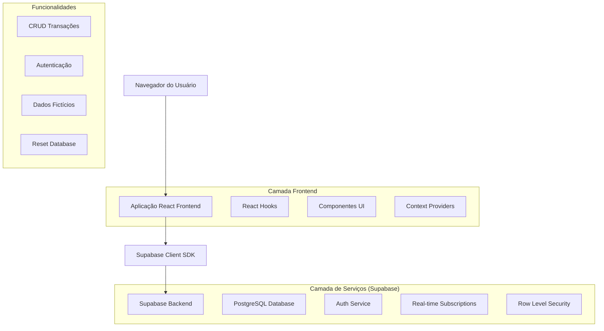
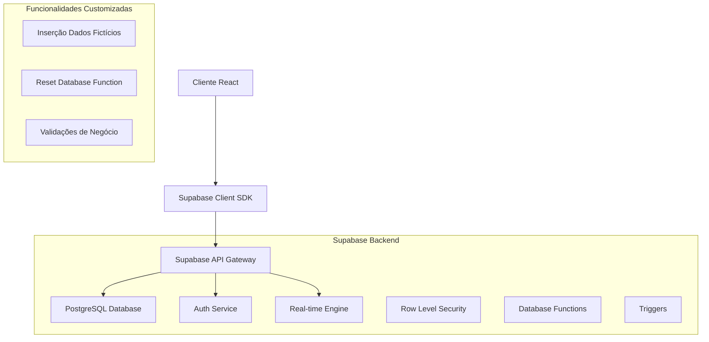
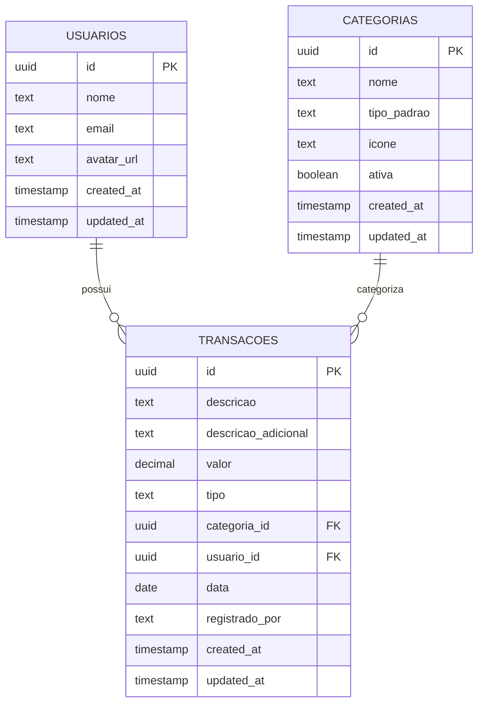

# Documentação Técnica - Integração Supabase ZetaFin

## 1. Arquitetura de Integração



## 2. Descrição das Tecnologias

- **Frontend**: React@19 + TypeScript + Vite + Tailwind CSS
- **Backend**: Supabase (PostgreSQL + Auth + Real-time)
- **Cliente**: @supabase/supabase-js@2.x
- **Validação**: Zod@3.24.3
- **Gráficos**: Recharts@3.2.1

## 3. Definições de Rotas

| Rota                  | Propósito                                                              |
| --------------------- | ---------------------------------------------------------------------- |
| /                     | Dashboard com dados do Supabase                                       |
| /transacoes           | Lista de transações sincronizada com Supabase                         |
| /nova-transacao       | Formulário para criar transação no Supabase                           |
| /editar-transacao/:id | Edição de transação específica no Supabase                            |
| /relatorios           | Relatórios baseados em dados do Supabase                              |
| /perfil/configuracoes | Configurações incluindo botão de reset do banco                       |

## 4. Definições de API (Supabase)

### 4.1 Operações CRUD via Supabase Client

**Buscar Transações**
```typescript
const { data, error } = await supabase
  .from('transacoes')
  .select(`
    *,
    categorias (
      id,
      nome,
      icone,
      tipo_padrao
    )
  `)
  .order('data', { ascending: false });
```

**Criar Transação**
```typescript
const { data, error } = await supabase
  .from('transacoes')
  .insert([{
    descricao,
    valor,
    tipo,
    categoria_id,
    data,
    registrado_por
  }])
  .select();
```

**Atualizar Transação**
```typescript
const { data, error } = await supabase
  .from('transacoes')
  .update({
    descricao,
    valor,
    tipo,
    categoria_id,
    data
  })
  .eq('id', transacaoId)
  .select();
```

**Deletar Transação**
```typescript
const { error } = await supabase
  .from('transacoes')
  .delete()
  .eq('id', transacaoId);
```

## 5. Arquitetura do Servidor (Supabase)



## 6. Modelo de Dados

### 6.1 Definição do Modelo de Dados



### 6.2 DDL (Data Definition Language)

**Tabela de Usuários**
```sql
-- Criar tabela de usuários
CREATE TABLE usuarios (
    id UUID PRIMARY KEY DEFAULT gen_random_uuid(),
    nome VARCHAR(100) NOT NULL,
    email VARCHAR(255) UNIQUE NOT NULL,
    avatar_url TEXT,
    created_at TIMESTAMP WITH TIME ZONE DEFAULT NOW(),
    updated_at TIMESTAMP WITH TIME ZONE DEFAULT NOW()
);

-- Índices
CREATE INDEX idx_usuarios_email ON usuarios(email);

-- RLS (Row Level Security)
ALTER TABLE usuarios ENABLE ROW LEVEL SECURITY;

-- Políticas de segurança
CREATE POLICY "Usuários podem ver seus próprios dados" ON usuarios
    FOR SELECT USING (auth.uid() = id);

CREATE POLICY "Usuários podem atualizar seus próprios dados" ON usuarios
    FOR UPDATE USING (auth.uid() = id);
```

**Tabela de Categorias**
```sql
-- Criar tabela de categorias
CREATE TABLE categorias (
    id UUID PRIMARY KEY DEFAULT gen_random_uuid(),
    nome VARCHAR(100) NOT NULL,
    tipo_padrao VARCHAR(20) CHECK (tipo_padrao IN ('RECEITA', 'DESPESA', 'AMBOS')),
    icone VARCHAR(10),
    ativa BOOLEAN DEFAULT true,
    created_at TIMESTAMP WITH TIME ZONE DEFAULT NOW(),
    updated_at TIMESTAMP WITH TIME ZONE DEFAULT NOW()
);

-- Índices
CREATE INDEX idx_categorias_tipo_padrao ON categorias(tipo_padrao);
CREATE INDEX idx_categorias_ativa ON categorias(ativa);

-- RLS
ALTER TABLE categorias ENABLE ROW LEVEL SECURITY;

-- Políticas de segurança
CREATE POLICY "Categorias são públicas para leitura" ON categorias
    FOR SELECT USING (true);

CREATE POLICY "Apenas usuários autenticados podem modificar categorias" ON categorias
    FOR ALL USING (auth.role() = 'authenticated');

-- Dados iniciais das categorias
INSERT INTO categorias (nome, tipo_padrao, icone) VALUES
('Salário', 'RECEITA', '💰'),
('Freelances', 'RECEITA', '💻'),
('Investimentos', 'RECEITA', '📈'),
('Vendas', 'RECEITA', '🛍️'),
('Bônus', 'RECEITA', '🎁'),
('Alimentação', 'DESPESA', '🍽️'),
('Moradia', 'DESPESA', '🏠'),
('Transporte', 'DESPESA', '🚗'),
('Saúde', 'DESPESA', '🏥'),
('Lazer', 'DESPESA', '🎬'),
('Educação', 'DESPESA', '📚'),
('Vestuário', 'DESPESA', '👕'),
('Tecnologia', 'DESPESA', '📱'),
('Viagem', 'DESPESA', '✈️'),
('Casa e Jardim', 'DESPESA', '🌱'),
('Pets', 'DESPESA', '🐕'),
('Esportes', 'DESPESA', '⚽'),
('Beleza', 'DESPESA', '💄'),
('Outros', 'AMBOS', '📝');
```

**Tabela de Transações**
```sql
-- Criar tabela de transações
CREATE TABLE transacoes (
    id UUID PRIMARY KEY DEFAULT gen_random_uuid(),
    descricao VARCHAR(255) NOT NULL,
    descricao_adicional TEXT,
    valor DECIMAL(12,2) NOT NULL CHECK (valor > 0),
    tipo VARCHAR(20) NOT NULL CHECK (tipo IN ('RECEITA', 'DESPESA')),
    categoria_id UUID NOT NULL REFERENCES categorias(id),
    usuario_id UUID REFERENCES usuarios(id),
    data DATE NOT NULL,
    registrado_por VARCHAR(100) NOT NULL,
    created_at TIMESTAMP WITH TIME ZONE DEFAULT NOW(),
    updated_at TIMESTAMP WITH TIME ZONE DEFAULT NOW()
);

-- Índices
CREATE INDEX idx_transacoes_usuario_id ON transacoes(usuario_id);
CREATE INDEX idx_transacoes_categoria_id ON transacoes(categoria_id);
CREATE INDEX idx_transacoes_data ON transacoes(data DESC);
CREATE INDEX idx_transacoes_tipo ON transacoes(tipo);
CREATE INDEX idx_transacoes_created_at ON transacoes(created_at DESC);

-- RLS
ALTER TABLE transacoes ENABLE ROW LEVEL SECURITY;

-- Políticas de segurança
CREATE POLICY "Usuários podem ver suas próprias transações" ON transacoes
    FOR SELECT USING (auth.uid() = usuario_id);

CREATE POLICY "Usuários podem inserir suas próprias transações" ON transacoes
    FOR INSERT WITH CHECK (auth.uid() = usuario_id);

CREATE POLICY "Usuários podem atualizar suas próprias transações" ON transacoes
    FOR UPDATE USING (auth.uid() = usuario_id);

CREATE POLICY "Usuários podem deletar suas próprias transações" ON transacoes
    FOR DELETE USING (auth.uid() = usuario_id);
```

**Triggers para Updated_at**
```sql
-- Função para atualizar timestamp
CREATE OR REPLACE FUNCTION update_updated_at_column()
RETURNS TRIGGER AS $$
BEGIN
    NEW.updated_at = NOW();
    RETURN NEW;
END;
$$ language 'plpgsql';

-- Triggers
CREATE TRIGGER update_usuarios_updated_at BEFORE UPDATE ON usuarios
    FOR EACH ROW EXECUTE FUNCTION update_updated_at_column();

CREATE TRIGGER update_categorias_updated_at BEFORE UPDATE ON categorias
    FOR EACH ROW EXECUTE FUNCTION update_updated_at_column();

CREATE TRIGGER update_transacoes_updated_at BEFORE UPDATE ON transacoes
    FOR EACH ROW EXECUTE FUNCTION update_updated_at_column();
```

## 7. Funcionalidades Específicas

### 7.1 Inserção de Dados Fictícios

**Função para Inserir Dados dos Últimos 3 Meses**
```sql
CREATE OR REPLACE FUNCTION inserir_dados_ficticios(user_id UUID)
RETURNS void AS $$
DECLARE
    categoria_salario UUID;
    categoria_freelance UUID;
    categoria_alimentacao UUID;
    categoria_moradia UUID;
    categoria_transporte UUID;
    categoria_saude UUID;
    categoria_lazer UUID;
    categoria_bonus UUID;
    categoria_investimentos UUID;
    categoria_vendas UUID;
    categoria_educacao UUID;
    categoria_vestuario UUID;
    categoria_tecnologia UUID;
    categoria_viagem UUID;
    categoria_casa_jardim UUID;
    categoria_pets UUID;
    categoria_esportes UUID;
    categoria_beleza UUID;
    categoria_outros UUID;
BEGIN
    -- Buscar IDs das categorias
    SELECT id INTO categoria_salario FROM categorias WHERE nome = 'Salário';
    SELECT id INTO categoria_freelance FROM categorias WHERE nome = 'Freelances';
    SELECT id INTO categoria_alimentacao FROM categorias WHERE nome = 'Alimentação';
    SELECT id INTO categoria_moradia FROM categorias WHERE nome = 'Moradia';
    SELECT id INTO categoria_transporte FROM categorias WHERE nome = 'Transporte';
    SELECT id INTO categoria_saude FROM categorias WHERE nome = 'Saúde';
    SELECT id INTO categoria_lazer FROM categorias WHERE nome = 'Lazer';
    SELECT id INTO categoria_bonus FROM categorias WHERE nome = 'Bônus';
    SELECT id INTO categoria_investimentos FROM categorias WHERE nome = 'Investimentos';
    SELECT id INTO categoria_vendas FROM categorias WHERE nome = 'Vendas';
    SELECT id INTO categoria_educacao FROM categorias WHERE nome = 'Educação';
    SELECT id INTO categoria_vestuario FROM categorias WHERE nome = 'Vestuário';
    SELECT id INTO categoria_tecnologia FROM categorias WHERE nome = 'Tecnologia';
    SELECT id INTO categoria_viagem FROM categorias WHERE nome = 'Viagem';
    SELECT id INTO categoria_casa_jardim FROM categorias WHERE nome = 'Casa e Jardim';
    SELECT id INTO categoria_pets FROM categorias WHERE nome = 'Pets';
    SELECT id INTO categoria_esportes FROM categorias WHERE nome = 'Esportes';
    SELECT id INTO categoria_beleza FROM categorias WHERE nome = 'Beleza';
    SELECT id INTO categoria_outros FROM categorias WHERE nome = 'Outros';

    -- Inserir transações fictícias dos últimos 3 meses
    INSERT INTO transacoes (descricao, valor, tipo, categoria_id, usuario_id, data, registrado_por) VALUES
    -- NOVEMBRO 2024
    ('Salário João', 4500.00, 'RECEITA', categoria_salario, user_id, '2024-11-01', 'João'),
    ('Salário Maria', 3800.00, 'RECEITA', categoria_salario, user_id, '2024-11-01', 'Maria'),
    ('Aluguel', 1200.00, 'DESPESA', categoria_moradia, user_id, '2024-11-05', 'João'),
    ('Supermercado Carrefour', 520.00, 'DESPESA', categoria_alimentacao, user_id, '2024-11-08', 'Maria'),
    ('Freelance App Mobile', 1800.00, 'RECEITA', categoria_freelance, user_id, '2024-11-12', 'João'),
    ('Conta de Água', 85.00, 'DESPESA', categoria_moradia, user_id, '2024-11-15', 'Maria'),
    ('Jantar Romântico', 180.00, 'DESPESA', categoria_alimentacao, user_id, '2024-11-20', 'João'),
    ('Presente Amigo Secreto', 120.00, 'DESPESA', categoria_outros, user_id, '2024-11-25', 'Maria'),
    ('Black Friday - Eletrônicos', 850.00, 'DESPESA', categoria_tecnologia, user_id, '2024-11-29', 'Maria'),
    ('Black Friday - Roupas', 420.00, 'DESPESA', categoria_vestuario, user_id, '2024-11-29', 'João'),
    
    -- DEZEMBRO 2024
    ('Salário João', 4500.00, 'RECEITA', categoria_salario, user_id, '2024-12-01', 'João'),
    ('Salário Maria', 3800.00, 'RECEITA', categoria_salario, user_id, '2024-12-01', 'Maria'),
    ('Aluguel', 1200.00, 'DESPESA', categoria_moradia, user_id, '2024-12-05', 'João'),
    ('Conta de Luz Dezembro', 220.00, 'DESPESA', categoria_moradia, user_id, '2024-12-10', 'Maria'),
    ('Dividendos Fim de Ano', 1200.00, 'RECEITA', categoria_investimentos, user_id, '2024-12-15', 'João'),
    ('13º Salário João', 4500.00, 'RECEITA', categoria_bonus, user_id, '2024-12-20', 'João'),
    ('13º Salário Maria', 3800.00, 'RECEITA', categoria_bonus, user_id, '2024-12-20', 'Maria'),
    ('Presentes de Natal', 950.00, 'DESPESA', categoria_outros, user_id, '2024-12-22', 'João'),
    ('Ceia de Natal', 380.00, 'DESPESA', categoria_alimentacao, user_id, '2024-12-23', 'Maria'),
    ('Viagem Ano Novo', 1200.00, 'DESPESA', categoria_viagem, user_id, '2024-12-28', 'Maria'),
    
    -- JANEIRO 2025
    ('Salário João', 4650.00, 'RECEITA', categoria_salario, user_id, '2025-01-01', 'João'),
    ('Salário Maria', 3950.00, 'RECEITA', categoria_salario, user_id, '2025-01-01', 'Maria'),
    ('Academia - Matrícula Anual', 890.00, 'DESPESA', categoria_esportes, user_id, '2025-01-03', 'Maria'),
    ('Aluguel', 1250.00, 'DESPESA', categoria_moradia, user_id, '2025-01-05', 'João'),
    ('Supermercado Janeiro', 480.00, 'DESPESA', categoria_alimentacao, user_id, '2025-01-08', 'Maria'),
    ('Consulta Médica', 250.00, 'DESPESA', categoria_saude, user_id, '2025-01-10', 'João'),
    ('Freelance Janeiro', 1500.00, 'RECEITA', categoria_freelance, user_id, '2025-01-12', 'Maria'),
    ('Combustível', 200.00, 'DESPESA', categoria_transporte, user_id, '2025-01-14', 'João'),
    ('Streaming Disney+', 45.00, 'DESPESA', categoria_lazer, user_id, '2025-01-15', 'Maria'),
    ('Livros Técnicos', 180.00, 'DESPESA', categoria_educacao, user_id, '2025-01-16', 'João');
END;
$$ LANGUAGE plpgsql;
```

### 7.2 Função de Reset do Banco de Dados

```sql
CREATE OR REPLACE FUNCTION reset_user_data(user_id UUID)
RETURNS void AS $$
BEGIN
    -- Deletar todas as transações do usuário
    DELETE FROM transacoes WHERE usuario_id = user_id;
    
    -- Opcional: Resetar dados do usuário (manter apenas o essencial)
    UPDATE usuarios 
    SET updated_at = NOW()
    WHERE id = user_id;
    
    -- Log da operação
    RAISE NOTICE 'Dados do usuário % foram resetados com sucesso', user_id;
END;
$$ LANGUAGE plpgsql;
```

## 8. Configuração do Cliente Supabase

### 8.1 Variáveis de Ambiente

```env
VITE_SUPABASE_URL=https://your-project.supabase.co
VITE_SUPABASE_ANON_KEY=your-anon-key
```

### 8.2 Configuração do Cliente

```typescript
// src/lib/supabase.ts
import { createClient } from '@supabase/supabase-js'

const supabaseUrl = import.meta.env.VITE_SUPABASE_URL
const supabaseAnonKey = import.meta.env.VITE_SUPABASE_ANON_KEY

export const supabase = createClient(supabaseUrl, supabaseAnonKey)

// Tipos TypeScript para o banco
export interface Database {
  public: {
    Tables: {
      usuarios: {
        Row: {
          id: string
          nome: string
          email: string
          avatar_url: string | null
          created_at: string
          updated_at: string
        }
        Insert: {
          id?: string
          nome: string
          email: string
          avatar_url?: string | null
          created_at?: string
          updated_at?: string
        }
        Update: {
          id?: string
          nome?: string
          email?: string
          avatar_url?: string | null
          created_at?: string
          updated_at?: string
        }
      }
      categorias: {
        Row: {
          id: string
          nome: string
          tipo_padrao: string | null
          icone: string | null
          ativa: boolean | null
          created_at: string
          updated_at: string
        }
        Insert: {
          id?: string
          nome: string
          tipo_padrao?: string | null
          icone?: string | null
          ativa?: boolean | null
          created_at?: string
          updated_at?: string
        }
        Update: {
          id?: string
          nome?: string
          tipo_padrao?: string | null
          icone?: string | null
          ativa?: boolean | null
          created_at?: string
          updated_at?: string
        }
      }
      transacoes: {
        Row: {
          id: string
          descricao: string
          descricao_adicional: string | null
          valor: number
          tipo: string
          categoria_id: string
          usuario_id: string | null
          data: string
          registrado_por: string
          created_at: string
          updated_at: string
        }
        Insert: {
          id?: string
          descricao: string
          descricao_adicional?: string | null
          valor: number
          tipo: string
          categoria_id: string
          usuario_id?: string | null
          data: string
          registrado_por: string
          created_at?: string
          updated_at?: string
        }
        Update: {
          id?: string
          descricao?: string
          descricao_adicional?: string | null
          valor?: number
          tipo?: string
          categoria_id?: string
          usuario_id?: string | null
          data?: string
          registrado_por?: string
          created_at?: string
          updated_at?: string
        }
      }
    }
  }
}
```

## 9. Estratégia de Migração

### 9.1 Plano de Migração dos Dados Locais

1. **Fase 1: Configuração**
   - Configurar projeto Supabase
   - Criar tabelas e políticas de segurança
   - Configurar autenticação

2. **Fase 2: Migração de Código**
   - Substituir localStorage por Supabase client
   - Atualizar hooks para usar async/await
   - Implementar tratamento de erros

3. **Fase 3: Migração de Dados**
   - Criar função de importação de dados locais
   - Migrar dados existentes do localStorage
   - Validar integridade dos dados

4. **Fase 4: Funcionalidades Adicionais**
   - Implementar inserção de dados fictícios
   - Criar botão de reset do banco
   - Testes e validação final

### 9.2 Hook de Migração

```typescript
// src/hooks/useMigration.ts
import { useState } from 'react'
import { supabase } from '@/lib/supabase'

export function useMigration() {
  const [isMigrating, setIsMigrating] = useState(false)
  
  const migrateLocalData = async () => {
    setIsMigrating(true)
    
    try {
      // Buscar dados do localStorage
      const localData = localStorage.getItem('zetafin_data')
      if (!localData) return
      
      const { transacoes } = JSON.parse(localData)
      
      // Migrar transações para Supabase
      for (const transacao of transacoes) {
        await supabase.from('transacoes').insert({
          descricao: transacao.descricao,
          descricao_adicional: transacao.descricaoAdicional,
          valor: transacao.valor,
          tipo: transacao.tipo,
          categoria_id: transacao.categoriaId,
          data: transacao.data,
          registrado_por: transacao.registradoPor
        })
      }
      
      // Limpar localStorage após migração
      localStorage.removeItem('zetafin_data')
      
    } catch (error) {
      console.error('Erro na migração:', error)
      throw error
    } finally {
      setIsMigrating(false)
    }
  }
  
  return { migrateLocalData, isMigrating }
}
```

## 10. Implementação do Reset Database

### 10.1 Hook para Reset

```typescript
// src/hooks/useDatabase.ts
import { useState } from 'react'
import { supabase } from '@/lib/supabase'

export function useDatabase() {
  const [isResetting, setIsResetting] = useState(false)
  const [isInsertingFakeData, setIsInsertingFakeData] = useState(false)
  
  const resetDatabase = async () => {
    setIsResetting(true)
    
    try {
      const { data: { user } } = await supabase.auth.getUser()
      if (!user) throw new Error('Usuário não autenticado')
      
      const { error } = await supabase.rpc('reset_user_data', {
        user_id: user.id
      })
      
      if (error) throw error
      
    } catch (error) {
      console.error('Erro ao resetar banco:', error)
      throw error
    } finally {
      setIsResetting(false)
    }
  }
  
  const insertFakeData = async () => {
    setIsInsertingFakeData(true)
    
    try {
      const { data: { user } } = await supabase.auth.getUser()
      if (!user) throw new Error('Usuário não autenticado')
      
      const { error } = await supabase.rpc('inserir_dados_ficticios', {
        user_id: user.id
      })
      
      if (error) throw error
      
    } catch (error) {
      console.error('Erro ao inserir dados fictícios:', error)
      throw error
    } finally {
      setIsInsertingFakeData(false)
    }
  }
  
  return {
    resetDatabase,
    insertFakeData,
    isResetting,
    isInsertingFakeData
  }
}
```

## 11. Considerações de Segurança

### 11.1 Row Level Security (RLS)

- Todas as tabelas têm RLS habilitado
- Usuários só podem acessar seus próprios dados
- Categorias são públicas para leitura
- Políticas específicas para cada operação CRUD

### 11.2 Validação de Dados

- Validação no frontend com Zod
- Constraints no banco de dados
- Triggers para manter integridade

### 11.3 Autenticação

- Autenticação gerenciada pelo Supabase Auth
- Tokens JWT automáticos
- Sessões persistentes

## 12. Monitoramento e Logs

### 12.1 Logs de Operações

```sql
-- Tabela de logs (opcional)
CREATE TABLE logs_operacoes (
    id UUID PRIMARY KEY DEFAULT gen_random_uuid(),
    usuario_id UUID REFERENCES usuarios(id),
    operacao VARCHAR(50) NOT NULL,
    tabela_afetada VARCHAR(50),
    detalhes JSONB,
    created_at TIMESTAMP WITH TIME ZONE DEFAULT NOW()
);
```

### 12.2 Métricas de Performance

- Monitoramento via dashboard Supabase
- Alertas para operações lentas
- Análise de uso de recursos

Este documento fornece uma base completa para a integração do ZetaFin com Supabase, incluindo migração de dados, funcionalidades de reset e inserção de dados fictícios.