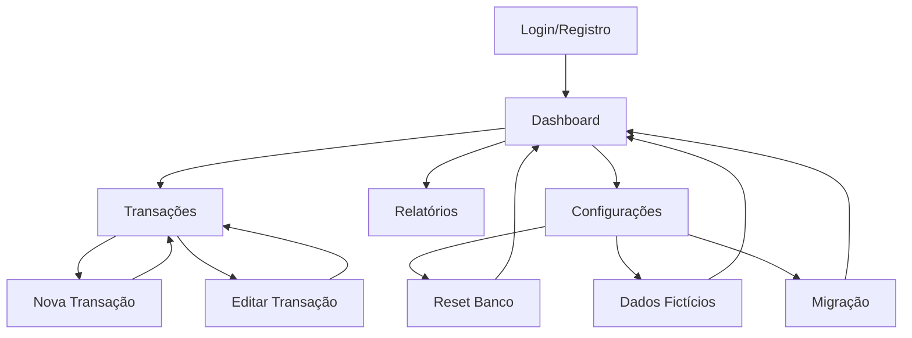

# PRD - Integração Supabase ZetaFin

## 1. Visão Geral do Produto

O ZetaFin será migrado de um sistema baseado em localStorage para uma arquitetura robusta com Supabase, oferecendo persistência de dados em nuvem, sincronização em tempo real e funcionalidades avançadas de gerenciamento de dados.

Esta integração permitirá que os usuários tenham seus dados financeiros seguros, acessíveis de qualquer dispositivo e com funcionalidades de backup automático. O sistema incluirá também ferramentas administrativas para inserção de dados fictícios e reset completo do banco de dados.

## 2. Funcionalidades Principais

### 2.1 Papéis de Usuário

| Papel | Método de Registro | Permissões Principais |
|-------|-------------------|----------------------|
| Usuário Padrão | Email + senha via Supabase Auth | Pode gerenciar suas próprias transações e dados financeiros |
| Administrador | Convite especial | Pode acessar funções de reset e inserção de dados fictícios |

### 2.2 Módulos de Funcionalidades

Nossa integração com Supabase consiste nas seguintes páginas principais:

1. **Dashboard**: Visão geral financeira com dados sincronizados em tempo real
2. **Transações**: Lista e gerenciamento de transações com CRUD completo via Supabase
3. **Relatórios**: Análises baseadas em dados do banco de dados em nuvem
4. **Configurações**: Painel administrativo com ferramentas de banco de dados
5. **Autenticação**: Sistema de login/registro integrado com Supabase Auth

### 2.3 Detalhes das Páginas

| Nome da Página | Nome do Módulo | Descrição da Funcionalidade |
|----------------|----------------|----------------------------|
| Dashboard | Visão Geral Financeira | Exibe saldo total, receitas, despesas e gráficos em tempo real. Dados sincronizados automaticamente com Supabase |
| Dashboard | Gráfico de Despesas | Mostra distribuição de gastos por categoria com dados atualizados do banco |
| Dashboard | Evolução Temporal | Gráfico de linha mostrando evolução do saldo ao longo do tempo |
| Transações | Lista de Transações | Exibe todas as transações do usuário com paginação e filtros. Dados carregados do Supabase |
| Transações | Filtros Avançados | Permite filtrar por categoria, tipo, período e valor usando queries otimizadas |
| Transações | CRUD Completo | Criar, editar e excluir transações com validação e sincronização automática |
| Nova Transação | Formulário de Criação | Formulário para adicionar novas transações com validação e salvamento no Supabase |
| Editar Transação | Formulário de Edição | Permite modificar transações existentes com atualização em tempo real |
| Relatórios | Análise por Categoria | Relatórios detalhados baseados em dados agregados do banco |
| Relatórios | Relatório Mensal | Análise mensal com gráficos e estatísticas calculadas no servidor |
| Configurações | Gerenciamento de Dados | Ferramentas para backup, restauração e migração de dados |
| Configurações | Reset do Banco | Botão para limpar todos os dados do usuário com confirmação dupla |
| Configurações | Dados Fictícios | Ferramenta para inserir dados de exemplo dos últimos 3 meses |
| Configurações | Migração de Dados | Interface para migrar dados do localStorage para Supabase |
| Autenticação | Login/Registro | Sistema de autenticação integrado com Supabase Auth |
| Autenticação | Recuperação de Senha | Funcionalidade de reset de senha via email |

## 3. Processo Principal

### 3.1 Fluxo do Usuário Padrão

O usuário acessa a aplicação e faz login através do sistema Supabase Auth. Após autenticado, pode visualizar seu dashboard com dados financeiros sincronizados em tempo real. Pode criar, editar e excluir transações que são automaticamente salvas no banco de dados em nuvem. Os relatórios são gerados dinamicamente baseados nos dados atualizados.

### 3.2 Fluxo do Administrador

Administradores têm acesso adicional às configurações avançadas, podendo inserir dados fictícios para demonstração, resetar completamente o banco de dados de um usuário e gerenciar migrações de dados.

### 3.3 Fluxo de Migração

Usuários existentes podem migrar seus dados do localStorage para Supabase através de uma interface dedicada que valida e transfere todas as transações mantendo a integridade dos dados.

## 4. Design da Interface do Usuário

### 4.1 Estilo de Design

- **Cores Primárias**: Azul (#3B82F6) para elementos principais, Verde (#10B981) para receitas, Vermelho (#EF4444) para despesas
- **Cores Secundárias**: Cinza (#6B7280) para textos secundários, Branco/Preto para fundos conforme tema
- **Estilo dos Botões**: Arredondados com sombras suaves, estados hover e loading bem definidos
- **Fonte**: Inter ou system fonts, tamanhos de 14px a 24px conforme hierarquia
- **Layout**: Design baseado em cards com espaçamento generoso, navegação lateral responsiva
- **Ícones**: Lucide React com estilo minimalista e consistente

### 4.2 Visão Geral do Design das Páginas

| Nome da Página | Nome do Módulo | Elementos da UI |
|----------------|----------------|-----------------|
| Dashboard | Visão Geral | Cards com estatísticas, indicadores de loading durante sincronização, badges de status de conexão |
| Dashboard | Gráficos | Gráficos Recharts com cores consistentes, tooltips informativos, legendas com percentuais |
| Transações | Lista | Tabela responsiva com paginação, filtros dropdown, botões de ação com confirmação |
| Transações | Estados de Loading | Skeletons durante carregamento, spinners para operações CRUD, mensagens de erro amigáveis |
| Nova Transação | Formulário | Campos validados em tempo real, seletor de categoria com ícones, botão de salvar com loading |
| Configurações | Ferramentas Admin | Seção destacada com botões de ação perigosa, modais de confirmação, progress bars para operações |
| Configurações | Reset Banco | Modal com confirmação dupla, input de confirmação por texto, botão vermelho destacado |
| Configurações | Dados Fictícios | Preview dos dados a serem inseridos, seletor de período, botão de inserção com feedback |
| Autenticação | Login/Registro | Formulário centralizado, validação visual, links de recuperação, integração com Supabase Auth |

### 4.3 Responsividade

O produto é mobile-first com adaptação completa para desktop. Inclui otimizações para touch em dispositivos móveis, navegação por gestos e layouts que se adaptam automaticamente ao tamanho da tela. Todas as funcionalidades de banco de dados funcionam perfeitamente em qualquer dispositivo.

## 5. Funcionalidades Específicas da Integração

### 5.1 Sincronização em Tempo Real

- Atualizações automáticas quando dados são modificados
- Indicadores visuais de status de sincronização
- Resolução de conflitos em caso de edições simultâneas
- Cache local para funcionamento offline limitado

### 5.2 Segurança e Privacidade

- Row Level Security (RLS) garantindo isolamento de dados por usuário
- Autenticação JWT automática via Supabase
- Criptografia de dados sensíveis
- Logs de auditoria para operações críticas

### 5.3 Performance e Otimização

- Queries otimizadas com índices apropriados
- Paginação para listas grandes
- Cache inteligente de dados frequentemente acessados
- Lazy loading de componentes pesados

### 5.4 Backup e Recuperação

- Backup automático via Supabase
- Exportação manual de dados em múltiplos formatos
- Funcionalidade de restauração de dados
- Versionamento de mudanças críticas

### 5.5 Ferramentas de Desenvolvimento

- Inserção de dados fictícios para testes
- Reset completo do banco para desenvolvimento
- Migração assistida de dados locais
- Logs detalhados para debugging

## 6. Critérios de Aceitação

### 6.1 Funcionalidades Básicas

- ✅ Usuário pode fazer login/registro via Supabase Auth
- ✅ Todas as transações são salvas e carregadas do Supabase
- ✅ Dashboard atualiza em tempo real
- ✅ Filtros e buscas funcionam com queries otimizadas
- ✅ CRUD completo de transações funciona perfeitamente

### 6.2 Funcionalidades Avançadas

- ✅ Botão de reset do banco funciona com confirmação dupla
- ✅ Inserção de dados fictícios dos últimos 3 meses
- ✅ Migração de dados do localStorage para Supabase
- ✅ Sincronização em tempo real entre dispositivos
- ✅ Funcionamento offline básico com sincronização posterior

### 6.3 Performance e Segurança

- ✅ Carregamento inicial em menos de 3 segundos
- ✅ Operações CRUD em menos de 1 segundo
- ✅ RLS funcionando corretamente
- ✅ Dados isolados por usuário
- ✅ Backup automático funcionando

### 6.4 Experiência do Usuário

- ✅ Interface responsiva em todos os dispositivos
- ✅ Feedback visual para todas as operações
- ✅ Mensagens de erro claras e acionáveis
- ✅ Estados de loading bem definidos
- ✅ Navegação intuitiva e consistente

## 7. Roadmap de Implementação

### 7.1 Fase 1: Configuração Base (Semana 1)
- Configurar projeto Supabase
- Criar esquema do banco de dados
- Implementar autenticação básica
- Configurar RLS e políticas de segurança

### 7.2 Fase 2: Migração Core (Semana 2)
- Substituir localStorage por Supabase client
- Implementar CRUD básico de transações
- Atualizar hooks para async/await
- Implementar tratamento de erros

### 7.3 Fase 3: Funcionalidades Avançadas (Semana 3)
- Implementar sincronização em tempo real
- Criar ferramentas de reset e dados fictícios
- Implementar migração de dados locais
- Otimizar queries e performance

### 7.4 Fase 4: Polimento e Testes (Semana 4)
- Testes extensivos de todas as funcionalidades
- Otimizações de UX e performance
- Documentação final
- Deploy e monitoramento

## 8. Métricas de Sucesso

### 8.1 Métricas Técnicas
- Tempo de carregamento inicial < 3s
- Tempo de resposta para operações CRUD < 1s
- Uptime do sistema > 99.9%
- Zero vazamentos de dados entre usuários

### 8.2 Métricas de Usuário
- Taxa de migração de dados locais > 90%
- Satisfação do usuário com nova performance > 4.5/5
- Redução de bugs relacionados a dados > 80%
- Aumento na retenção de usuários > 25%

### 8.3 Métricas de Negócio
- Redução de custos de suporte > 50%
- Capacidade de escalar para 10x mais usuários
- Tempo de desenvolvimento de novas features reduzido em 40%
- Facilidade de backup e recuperação de dados

Esta integração com Supabase transformará o ZetaFin em uma aplicação robusta, escalável e confiável, oferecendo aos usuários uma experiência superior de gestão financeira com a segurança e performance de uma solução em nuvem profissional.