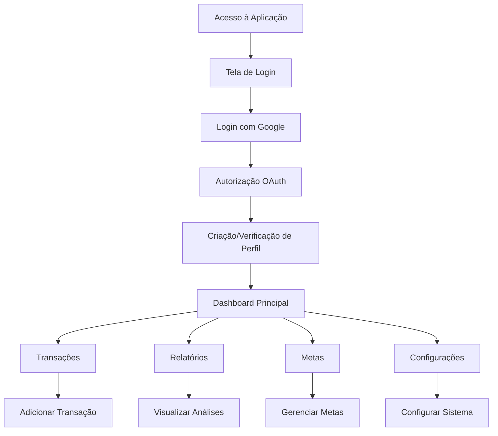

# PRD - Integração ZetaFin com Supabase e Autenticação Google

## 1. Visão Geral do Produto

O ZetaFin será migrado de um sistema baseado em localStorage para uma solução completa na nuvem usando Supabase como backend e autenticação via Google OAuth. Esta migração permitirá sincronização de dados entre dispositivos, backup automático e uma experiência de usuário mais robusta e segura.

- **Objetivo Principal**: Transformar o ZetaFin em uma aplicação web completa com dados persistentes na nuvem
- **Público-Alvo**: Casais e indivíduos que desejam gerenciar suas finanças de forma colaborativa e segura
- **Valor de Mercado**: Solução SaaS de gestão financeira pessoal com sincronização multi-dispositivo

## 2. Funcionalidades Principais

### 2.1 Papéis de Usuário

| Papel | Método de Registro | Permissões Principais |
|-------|-------------------|----------------------|
| Usuário Autenticado | Login via Google OAuth | Acesso completo aos próprios dados financeiros |
| Usuário Anônimo | Não aplicável | Acesso apenas à tela de login |

### 2.2 Módulos de Funcionalidade

Nossa aplicação ZetaFin integrada consiste nas seguintes páginas principais:

1. **Tela de Login**: Autenticação via Google OAuth, redirecionamento automático
2. **Dashboard**: Visão geral financeira, gráficos e estatísticas em tempo real
3. **Transações**: Listagem, adição, edição e exclusão de transações financeiras
4. **Relatórios**: Análises por período, categorias, tendências e metas
5. **Perfil**: Configurações pessoais, dados do casal, preferências
6. **Configurações**: Gerenciamento de categorias, importação/exportação de dados

### 2.3 Detalhes das Páginas

| Página | Módulo | Descrição da Funcionalidade |
|--------|--------|----------------------------|
| Login | Autenticação | Login via Google OAuth, criação automática de perfil, redirecionamento para dashboard |
| Dashboard | Visão Geral | Exibir saldo atual, gráficos de despesas por categoria, transações recentes, progresso de metas |
| Transações | Gestão Financeira | Listar todas as transações, adicionar nova transação com categoria, editar/excluir transações existentes |
| Relatórios por Período | Análises | Filtrar por data, gráfico pizza de distribuição, ranking de gastos, exportação de dados |
| Relatórios por Categoria | Análises | Análise detalhada por categoria, comparação mensal, identificação de padrões |
| Gastos Frequentes | Análises | Identificar gastos recorrentes, sugestões de otimização, análise de tendências |
| Tendências e Projeções | Análises | Projeções futuras baseadas em histórico, alertas de gastos, recomendações |
| Acompanhamento de Metas | Metas | Criar/editar metas financeiras, acompanhar progresso, notificações de status |
| Perfil | Configurações | Dados pessoais, informações do casal, preferências de exibição |
| Configurações | Sistema | Gerenciar categorias personalizadas, importar/exportar dados CSV, configurações gerais |

## 3. Fluxo Principal de Usuário

### Fluxo de Autenticação e Uso
1. **Usuário acessa a aplicação** → Redirecionado para tela de login
2. **Clica em "Entrar com Google"** → Processo OAuth do Google
3. **Autoriza a aplicação** → Criação automática de perfil no Supabase
4. **Redirecionado para Dashboard** → Dados sincronizados da nuvem
5. **Navega pelas funcionalidades** → Todas as ações são salvas automaticamente
6. **Logout** → Sessão encerrada, dados permanecem seguros na nuvem

## 4. Design da Interface

### 4.1 Estilo de Design

- **Cores Primárias**: Azul (#3B82F6) e Verde (#10B981) para elementos financeiros positivos
- **Cores Secundárias**: Vermelho (#EF4444) para despesas, Cinza (#6B7280) para elementos neutros
- **Estilo de Botões**: Arredondados com sombra sutil, efeitos hover suaves
- **Tipografia**: Inter ou similar, tamanhos 14px (corpo), 16px (títulos), 24px (cabeçalhos)
- **Layout**: Design baseado em cards, navegação lateral fixa, responsivo mobile-first
- **Ícones**: Lucide React para consistência, ícones de categorias personalizáveis

### 4.2 Visão Geral do Design das Páginas

| Página | Módulo | Elementos de UI |
|--------|--------|-----------------|
| Login | Autenticação | Card centralizado, botão Google OAuth com ícone, fundo gradiente azul |
| Dashboard | Visão Geral | Grid responsivo, cards de estatísticas, gráficos Chart.js, lista de transações recentes |
| Transações | Lista/Formulário | Tabela responsiva, modal de adição/edição, filtros por data/categoria, paginação |
| Relatórios | Gráficos | Filtros de período, gráficos interativos, cards de resumo, botões de exportação |
| Perfil | Formulário | Formulário de duas colunas, upload de avatar, seções organizadas em tabs |
| Configurações | Gestão | Lista de categorias com ações, botões de importação/exportação, confirmações de ações |

### 4.3 Responsividade

- **Desktop-first** com adaptação mobile completa
- **Breakpoints**: 768px (tablet), 640px (mobile)
- **Navegação mobile**: Menu hambúrguer, navegação bottom em telas pequenas
- **Touch optimization**: Botões com área mínima de 44px, gestos de swipe para ações

## 5. Funcionalidades Técnicas Específicas

### 5.1 Autenticação e Segurança
- Login exclusivo via Google OAuth através do Supabase Auth
- Criação automática de perfil de usuário na primeira autenticação
- Row Level Security (RLS) para isolamento completo de dados entre usuários
- Sessões persistentes com refresh automático de tokens

### 5.2 Sincronização de Dados
- Migração automática de dados do localStorage para Supabase na primeira autenticação
- Sincronização em tempo real entre dispositivos
- Backup automático de todos os dados na nuvem
- Capacidade de trabalhar offline com sincronização posterior

### 5.3 Gestão de Categorias
- Categorias padrão criadas automaticamente para novos usuários
- Capacidade de criar, editar e excluir categorias personalizadas
- Validação para impedir exclusão de categorias com transações associadas
- Ícones e cores personalizáveis para cada categoria

### 5.4 Importação e Exportação
- Importação de dados via arquivo CSV com formato específico
- Exportação de dados para CSV e JSON
- Validação de dados durante importação
- Opção de "zerar tudo e importar" para reset completo

### 5.5 Relatórios e Análises
- Cálculos em tempo real baseados em dados do Supabase
- Filtros dinâmicos por período, categoria e tipo de transação
- Gráficos interativos com Chart.js
- Projeções e tendências baseadas em histórico

## 6. Critérios de Aceitação

### 6.1 Autenticação
- [ ] Usuário pode fazer login apenas via Google OAuth
- [ ] Perfil é criado automaticamente na primeira autenticação
- [ ] Dados do localStorage são migrados automaticamente
- [ ] Logout funciona corretamente e limpa a sessão

### 6.2 Sincronização
- [ ] Dados são salvos automaticamente no Supabase
- [ ] Mudanças aparecem em tempo real em outros dispositivos
- [ ] Aplicação funciona offline e sincroniza quando conecta
- [ ] Não há perda de dados durante a migração

### 6.3 Funcionalidades Financeiras
- [ ] Todas as operações CRUD funcionam para transações
- [ ] Categorias podem ser criadas, editadas e excluídas
- [ ] Relatórios são gerados corretamente a partir dos dados
- [ ] Metas são calculadas e atualizadas automaticamente

### 6.4 Interface e Experiência
- [ ] Interface responsiva funciona em desktop e mobile
- [ ] Navegação é intuitiva e consistente
- [ ] Feedback visual adequado para todas as ações
- [ ] Performance adequada mesmo com muitos dados

## 7. Métricas de Sucesso

### 7.1 Métricas Técnicas
- Tempo de carregamento inicial < 3 segundos
- Tempo de sincronização < 1 segundo para operações simples
- Taxa de erro de autenticação < 1%
- Disponibilidade do sistema > 99.5%

### 7.2 Métricas de Usuário
- Taxa de conclusão do primeiro login > 95%
- Taxa de retenção após 7 dias > 80%
- Satisfação do usuário com a sincronização > 4.5/5
- Número de transações criadas por usuário ativo > 10/mês

## 8. Cronograma de Implementação

### 8.1 Fase 1 - Configuração (Semana 1)
- Configurar projeto Supabase
- Implementar autenticação Google OAuth
- Criar estrutura de banco de dados
- Configurar políticas de segurança RLS

### 8.2 Fase 2 - Migração (Semana 2)
- Implementar hooks de dados para Supabase
- Criar sistema de migração do localStorage
- Atualizar componentes para usar novos hooks
- Testes de migração e sincronização

### 8.3 Fase 3 - Refinamento (Semana 3)
- Implementar funcionalidades offline
- Otimizar performance e carregamento
- Testes de usabilidade e correções
- Preparação para deploy em produção

### 8.4 Fase 4 - Deploy e Monitoramento (Semana 4)
- Deploy em ambiente de produção
- Configuração de monitoramento e analytics
- Testes finais com usuários reais
- Documentação e treinamento

## 9. Riscos e Mitigações

### 9.1 Riscos Técnicos
- **Perda de dados durante migração**: Implementar backup automático antes da migração
- **Problemas de performance**: Otimizar queries e implementar cache
- **Falhas de autenticação**: Implementar fallbacks e logs detalhados

### 9.2 Riscos de Usuário
- **Resistência à mudança**: Comunicar benefícios claramente
- **Dificuldades com Google OAuth**: Fornecer documentação e suporte
- **Perda de dados locais**: Garantir migração automática e transparente

## 10. Considerações Futuras

### 10.1 Funcionalidades Adicionais
- Compartilhamento de dados entre usuários (casais)
- Notificações push para metas e lembretes
- Integração com bancos via Open Banking
- Aplicativo mobile nativo

### 10.2 Escalabilidade
- Suporte a múltiplos idiomas
- Diferentes moedas e localizações
- Planos premium com funcionalidades avançadas
- API pública para integrações

Este PRD define claramente os requisitos para a migração do ZetaFin para uma solução completa baseada em Supabase, garantindo que todas as funcionalidades existentes sejam preservadas e melhoradas com recursos de sincronização e segurança na nuvem.