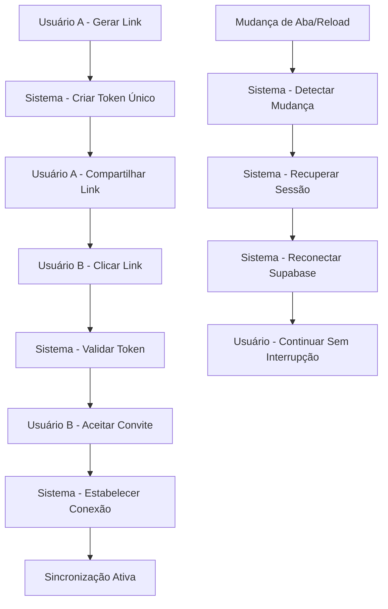

# PRD - Melhorias no Sistema de Conexão de Parceiros

## 1. Visão Geral do Produto

O ZetaFin é uma aplicação de gestão financeira pessoal que permite aos usuários compartilhar dados financeiros com seus parceiros. Este documento define melhorias críticas no sistema de conexão entre parceiros para resolver problemas de estabilidade e facilitar o processo de conexão através de links compartilháveis.

- **Problema Principal**: Usuários enfrentam desconexões frequentes ao trocar abas do navegador e dificuldades para conectar parceiros usando apenas códigos de 6 caracteres.
- **Objetivo**: Implementar conexão via links compartilháveis e melhorar significativamente a estabilidade das conexões existentes.
- **Valor de Mercado**: Aumentar a retenção de usuários e facilitar a adoção em casais através de uma experiência mais confiável e intuitiva.

## 2. Funcionalidades Principais

### 2.1 Papéis de Usuário

| Papel | Método de Registro | Permissões Principais |
|-------|-------------------|----------------------|
| Usuário Individual | Email/Google | Pode gerenciar finanças pessoais e iniciar conexões com parceiros |
| Usuário Conectado | Conexão via código ou link | Compartilha dados financeiros em tempo real com parceiro |

### 2.2 Módulos de Funcionalidade

Nossas melhorias no sistema de conexão consistem nas seguintes páginas principais:
1. **Página de Dados do Casal**: interface aprimorada para conexão, gerenciamento de links compartilháveis e monitoramento de status de conexão.
2. **Sistema de Autenticação**: persistência robusta de sessão e reconexão automática.
3. **Página de Convite via Link**: nova interface para aceitar convites através de links compartilháveis.

### 2.3 Detalhes das Páginas

| Nome da Página | Nome do Módulo | Descrição da Funcionalidade |
|----------------|----------------|------------------------------|
| Dados do Casal | Geração de Links | Criar links únicos e seguros para conexão com parceiros. Incluir opções de expiração e revogação de links. |
| Dados do Casal | Compartilhamento Avançado | Compartilhar links via WhatsApp, email, redes sociais ou copiar para área de transferência. |
| Dados do Casal | Status de Conexão | Monitorar status da conexão em tempo real, exibir indicadores visuais de conectividade e histórico de conexões. |
| Sistema de Auth | Persistência de Sessão | Implementar armazenamento robusto de sessão com recuperação automática após mudanças de aba ou recarregamento. |
| Sistema de Auth | Reconexão Automática | Detectar perda de conexão e tentar reconectar automaticamente com feedback visual para o usuário. |
| Convite via Link | Aceitação de Convite | Nova página para processar links de convite, validar tokens e estabelecer conexão entre parceiros. |
| Convite via Link | Validação de Segurança | Verificar validade do link, autenticação do usuário e prevenção contra ataques de engenharia social. |

## 3. Processo Principal

### Fluxo de Conexão via Link Compartilhável:

1. **Usuário A** acessa "Dados do Casal" e gera um link de convite
2. **Usuário A** compartilha o link via WhatsApp, email ou outras plataformas
3. **Usuário B** clica no link e é direcionado para página de aceitação de convite
4. **Sistema** valida o token do link e autentica o Usuário B
5. **Usuário B** confirma a conexão e ambos ficam conectados automaticamente
6. **Sistema** estabelece sincronização bidirecional de dados financeiros

### Fluxo de Melhoria de Estabilidade:

1. **Sistema** monitora continuamente o status da conexão de rede
2. **Sistema** persiste dados de sessão em múltiplas camadas (localStorage, sessionStorage, IndexedDB)
3. **Usuário** troca de aba ou recarrega a página
4. **Sistema** detecta a mudança e recupera automaticamente a sessão
5. **Sistema** reestabelece conexões com Supabase sem perda de dados
6. **Usuário** continua usando a aplicação sem interrupções

## 4. Design da Interface do Usuário

### 4.1 Estilo de Design

- **Cores Primárias**: Rosa (#FF6B6B) para ações de conexão, Azul (#4ECDC4) para status conectado
- **Cores Secundárias**: Verde (#96CEB4) para sucesso, Vermelho (#FF4757) para erros
- **Estilo de Botões**: Arredondados com gradientes suaves e efeitos hover
- **Fontes**: Inter para textos principais, tamanhos 14px-24px
- **Layout**: Design baseado em cards com navegação superior e indicadores visuais de status
- **Ícones**: Lucide React com estilo minimalista, emojis para categorias

### 4.2 Visão Geral do Design das Páginas

| Nome da Página | Nome do Módulo | Elementos da UI |
|----------------|----------------|-----------------|
| Dados do Casal | Geração de Links | Card com botão "Gerar Link de Convite", campo de texto com link gerado, botões de compartilhamento (WhatsApp, Email, Copiar), indicador de expiração do link |
| Dados do Casal | Status de Conexão | Indicador visual de conectividade (verde pulsante para conectado, amarelo para reconectando, vermelho para desconectado), histórico de últimas conexões, tempo de conexão ativa |
| Convite via Link | Aceitação de Convite | Card centralizado com informações do remetente, botão de aceitar/recusar convite, indicadores de segurança, animações de carregamento durante processamento |
| Sistema Global | Indicadores de Rede | Toast notifications para mudanças de status, barra de progresso para reconexão, ícones de status na barra superior |

### 4.3 Responsividade

O produto é mobile-first com adaptação completa para desktop. Inclui otimizações para touch em dispositivos móveis, especialmente para compartilhamento de links via aplicativos nativos como WhatsApp e Telegram.