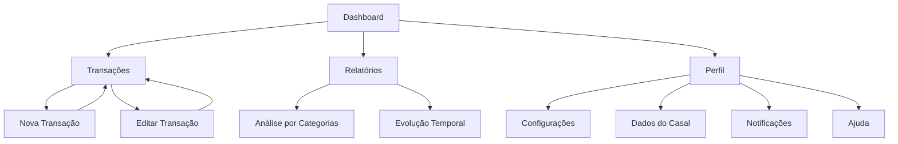

# Documento de Requisitos do Produto - ZetaFin

## 1. Visão Geral do Produto

ZetaFin é uma aplicação web moderna de gestão financeira desenvolvida especificamente para casais que desejam organizar e controlar suas finanças de forma colaborativa. A plataforma oferece ferramentas intuitivas para acompanhamento de receitas, despesas, análises financeiras e planejamento conjunto, promovendo transparência e organização na vida financeira do casal.

O produto visa resolver os principais problemas de gestão financeira doméstica: falta de visibilidade dos gastos, dificuldade em categorizar despesas, ausência de planejamento conjunto e falta de ferramentas adequadas para análise financeira familiar.

## 2. Funcionalidades Principais

### 2.1 Papéis de Usuário

| Papel | Método de Registro | Permissões Principais |
|-------|-------------------|----------------------|
| Usuário Individual | Registro por email | Pode gerenciar suas próprias transações e visualizar relatórios pessoais |
| Casal Conectado | Convite do parceiro | Pode visualizar e gerenciar transações compartilhadas, acessar dados do casal |

### 2.2 Módulo de Funcionalidades

Nossa aplicação ZetaFin consiste nas seguintes páginas principais:

1. **Dashboard**: painel principal, estatísticas financeiras, gráficos de evolução, últimas transações
2. **Transações**: listagem completa, filtros avançados, busca por período, categorização
3. **Nova Transação**: formulário de cadastro, seleção de categoria, definição de tipo (receita/despesa)
4. **Editar Transação**: modificação de dados, atualização de categoria, correção de valores
5. **Relatórios**: análises detalhadas, gráficos por categoria, tendências mensais, projeções
6. **Perfil**: configurações pessoais, dados do casal, notificações, ajuda e suporte

### 2.3 Detalhes das Páginas

| Nome da Página | Nome do Módulo | Descrição da Funcionalidade |
|----------------|----------------|----------------------------|
| Dashboard | Painel Principal | Exibir visão geral financeira com saldo atual, estatísticas de receitas/despesas do mês, gráfico de evolução do saldo |
| Dashboard | Cartões de Estatísticas | Mostrar saldo total, receitas do mês, despesas do mês e economia com indicadores visuais |
| Dashboard | Últimas Transações | Listar as 5 transações mais recentes com categoria, valor e data |
| Transações | Lista de Transações | Exibir todas as transações com paginação, ordenação por data, valor ou categoria |
| Transações | Filtros Avançados | Filtrar por período, categoria, tipo (receita/despesa), valor mínimo/máximo |
| Transações | Busca | Pesquisar transações por descrição ou categoria |
| Nova Transação | Formulário de Cadastro | Criar nova transação com descrição, valor, categoria, data e tipo |
| Nova Transação | Seleção de Categoria | Escolher categoria predefinida ou criar nova categoria personalizada |
| Editar Transação | Formulário de Edição | Modificar dados de transação existente mantendo histórico de alterações |
| Relatórios | Análise por Categorias | Gráfico de pizza mostrando distribuição de gastos por categoria |
| Relatórios | Evolução Temporal | Gráfico de linha mostrando evolução do saldo ao longo do tempo |
| Relatórios | Relatórios Mensais | Comparativo mensal de receitas vs despesas com tendências |
| Perfil | Informações Pessoais | Gerenciar dados do usuário, foto de perfil, informações de contato |
| Perfil | Configurações | Ajustar preferências de notificação, tema, moeda padrão |
| Perfil | Dados do Casal | Conectar com parceiro, visualizar estatísticas compartilhadas |
| Perfil | Notificações | Configurar alertas de gastos, lembretes de orçamento, notificações push |
| Perfil | Ajuda e Suporte | Acessar FAQ, tutoriais, contato com suporte |

## 3. Processo Principal

### Fluxo do Usuário Individual
O usuário acessa o dashboard para visualizar sua situação financeira atual, navega para transações para revisar gastos recentes, adiciona nova transação quando necessário, consulta relatórios para análise de padrões de gastos e acessa o perfil para configurações pessoais.

### Fluxo do Casal
Ambos os parceiros acessam o dashboard compartilhado, visualizam transações conjuntas, adicionam transações que afetam o orçamento familiar, analisam relatórios de gastos do casal e gerenciam configurações compartilhadas no perfil.

## 4. Design da Interface do Usuário

### 4.1 Estilo de Design

- **Cores Primárias**: Azul (#3B82F6) e Roxo (#8B5CF6) para elementos principais
- **Cores Secundárias**: Cinza (#6B7280) para textos e Verde (#10B981) para receitas, Vermelho (#EF4444) para despesas
- **Estilo de Botões**: Cantos arredondados (rounded-lg), efeitos de hover suaves, sombras sutis
- **Tipografia**: Inter como fonte principal, tamanhos de 14px a 24px, peso normal a bold
- **Layout**: Design baseado em cards, navegação inferior fixa, espaçamento consistente de 16px/24px
- **Ícones**: Lucide React com estilo minimalista e moderno

### 4.2 Visão Geral do Design das Páginas

| Nome da Página | Nome do Módulo | Elementos da UI |
|----------------|----------------|-----------------|
| Dashboard | Painel Principal | Cards com gradiente azul-roxo, gráficos interativos, layout em grid responsivo |
| Dashboard | Estatísticas | Cards brancos com sombra sutil, ícones coloridos, valores em destaque |
| Transações | Lista | Tabela responsiva, badges coloridos para categorias, botões de ação discretos |
| Transações | Filtros | Dropdown elegante, date picker customizado, botões de filtro com estados ativos |
| Nova Transação | Formulário | Campos com bordas arredondadas, validação em tempo real, botão principal destacado |
| Relatórios | Gráficos | Charts responsivos com cores consistentes, tooltips informativos, legendas claras |
| Perfil | Menu | Lista com ícones coloridos, separadores sutis, indicadores de navegação |

### 4.3 Responsividade

O produto é desenvolvido com abordagem mobile-first, garantindo experiência otimizada em dispositivos móveis. A interface se adapta automaticamente a diferentes tamanhos de tela, com navegação por tabs na parte inferior em dispositivos móveis e sidebar em desktop. Todos os componentes são otimizados para interação touch, com áreas de toque adequadas e gestos intuitivos.